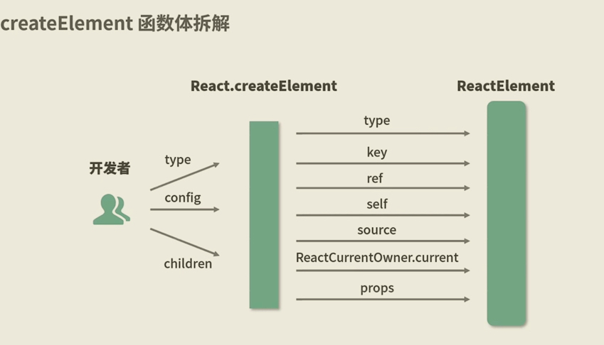
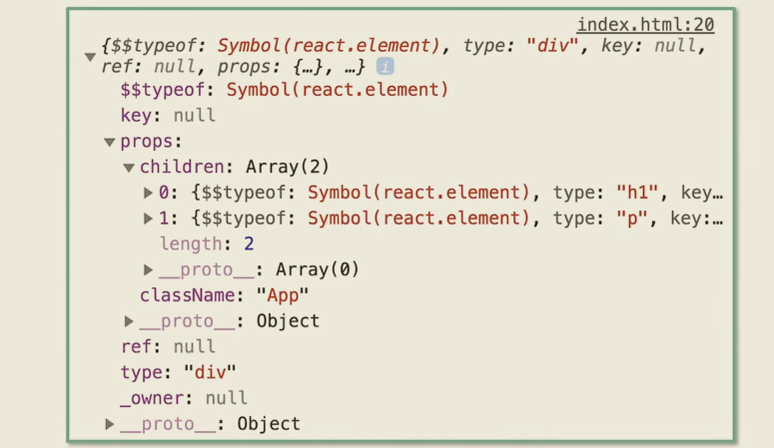
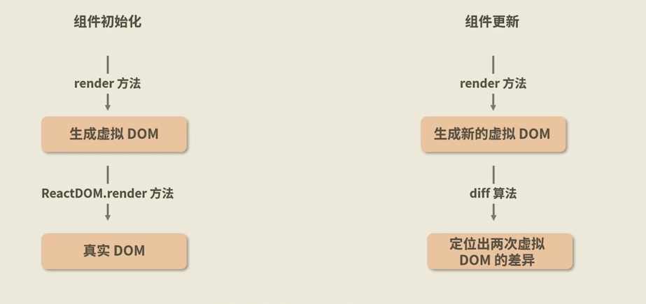

这里简单介绍一下从jsx到渲染页面的整个流程！
## 一、概念
从概念上来说，jsx(JavaScript XML)是 JavaScript 的语法扩展，允许在 JavaScript 代码中直接编写类似HTML的结构。如下所示：
```jsx
const element = <h1>Hello, JSX!</h1>;
```
JSX会被编译器(Babel)编译为React.createElement()。React.createElement()将返回一个叫做“ReactElement”的JS对象。举例：
```jsx
<div className='App'>
    <h1 className='title'>I am the title</h1>
    <p className='content'>I am the content</p>
</div>
```
bable编译后：
```js
'use strict';
React.createElement('div', { className: 'App' }, 
    React.createElement('h1', {
        className: 'title'
    }, 'I am the title'),
    React.createElement('p', {
        className: 'content'
    }, 'I am the content')
);
```
这里介绍一下React.createElement语法：`createElement(type, props, ...children)`。调用 createElement 来创建一个 React 元素，它有 type、props 和 children 三个参数。其中：
1. type：type 参数必须是一个有效的 React 组件类型，例如一个字符串标签名（如 'div' 或 'span'），或一个 React 组件（一个函数式组件、一个类式组件，或者是一个特殊的组件如 Fragment）。

2. props：props 参数必须是一个对象或 null。如果你传入 null，它会被当作一个空对象。创建的 React 元素的 props 与这个参数相同。注意，props 对象中的 ref 和 key 比较特殊，它们 不会 作为 element.props.ref 和 element.props.key 出现在创建的元素 element 上，而是作为 element.ref 和 element.key 出现。

3. 可选 ...children：零个或多个子节点。它们可以是任何 React 节点，包括 React 元素、字符串、数字、portal、空节点（null、undefined、true 和 false），以及 React 节点数组。

## 二、ReactElement
看到这里，大家可能产生一些疑问。
# 1、Babel转译JSX成React.createElement()形式
第一个疑问是，JSX中还有像`const element = <h1>Hello, JSX!</h1>;`这种表达式写法，然后嵌入到某个组件中的，这是哪个步骤操作的。如下：
```jsx
import React from 'react';
// 1. 定义一个JSX元素
const element = <h1>Hello, JSX!</h1>;
// 2. 定义一个React组件
function App () {
    return (
        <div>
            {element}
            <p>This is a react component</p>
        </div>
    )
}
export default App;
```
JSX被Babel转换为React.createElement的代码如下：
```js
import React from 'react';

const element = React.createElement('h1', null, 'Hello, JSX!');

fuction App() {
    return React.createElement('div', null, element, React.createElement('p', null, 'This is a react component'));
}

export default App;
```
到这里我们发现Babel主要是将JSX转为了`React.createElement`形式。那接下来会怎么样呢？毕竟这样的代码也没法运行啊，甚至App里还有element这个变量在呢！

# 2、React.createElement()生成ReactElement对象
这里我们就介绍一下React.createElement。如下图所示，React.createElement会对入参进行处理，最后发起ReactElement调用。element变量的替换也是React在执行createElement期间操作的。
  

ReactElement的代码如下，作用是组装一个ReactElement对象：
```js
const ReactElement = function(type, key, ref, self, source, owner, props) {
    const element = {
        // 标识该对象是一个
        $$typeof: REACT_ELEMENT_TYPE;

        // 内置属性
        type: type,
        key: key,
        ref: ref,
        props: props,

        // 记录创造该元素的组件
        _owner: owner,
    };
    return element;
}
```
验证方法，可以通过console.log打印一个JSX就可以得到一个标准的ReactElement对象。下面代码的输出如下图所示。
```jsx
const element = <h1 className='title'>I am the title</h1>; // element会编译成一个ReactElement对象
const AppJSX = 
    <div className='App'>
        {element} {/* 这个替换是React在createElement在运行时会进行的，和Babel无关*/}
        <p className='content'>I am the content</p>
    </div>;
console.log(AppJSX); // AppJSX会编译成一个ReactElement对象
```


# 3、虚拟DOM渲染真实DOM
上面的ReactElement到底是什么呢？其实，ReactElement本质上就是虚拟DOM。虚拟DOM由`ReactDOM.render`将其渲染成真实DOM。在每一个React项目的入口文件中，都会有ReactDOM.render。ReactDOM.render的语法如下：
```jsx
ReactDOM.render(
    // 需要渲染的元素(ReactElement)
    element,
    // 元素挂载的目标容器(一个真实DOM)
    container,
    // 回调函数，可选参数，可以用来处理渲染结束后的逻辑
    [callback]
);
```

上面App组件渲染在root节点的示例如下：
```jsx
const rootElement = document.getElementById('root');
ReactDOM.render(<App/>, rootElement);
```
这里root是真实的DOM，React实际上已经提前预制了root这个DOM，如下：
```html
<body>
    <div id='root'></div>
</body>
```
渲染的真实DOM如下：
```html
<body>
    <noscript>
        You need to enable JavaScript to run this app.
    </noscript>
    <div id='root'>
        <div className='App'>
            <h1 className='title'>I am the title</h1>
            <p className='content'>I am the content</p>
        </div>
    </div>
</body>
```

# 4、DOM渲染的过程
上面举了一个虚拟DOM渲染真实DOM的例子，但是没有介绍其中的细节。实际上，React并不是直接将整个虚拟DOM整个渲染一遍，完全取代原本的DOM。而是通过**虚拟DOM的对比(diffing算法)**来高效更新UI。假设当前的虚拟DOM如下：
```jsx
const prevElement = {
  type: 'div',
  props: {
    className: 'container',
    children: [
      {
        type: 'h1',
        props: {
          children: 'Hello, World!'
        },
        key: null,
        ref: null,
        $$typeof: Symbol.for('react.element')
      },
      {
        type: 'p',
        props: {
          children: 'This is a paragraph.'
        },
        key: null,
        ref: null,
        $$typeof: Symbol.for('react.element')
      }
    ]
  },
  key: null,
  ref: null,
  $$typeof: Symbol.for('react.element')
};
```
现在，用户操作导致UI更新，新的虚拟DOM如下：
```jsx
const nextElement = {
  type: 'div',
  props: {
    className: 'container',
    children: [
      {
        type: 'h1',
        props: {
          children: 'Hello, React!'
        },
        key: null,
        ref: null,
        $$typeof: Symbol.for('react.element')
      },
      {
        type: 'p',
        props: {
          children: 'This is a new paragraph.'
        },
        key: null,
        ref: null,
        $$typeof: Symbol.for('react.element')
      }
    ]
  },
  key: null,
  ref: null,
  $$typeof: Symbol.for('react.element')
};
```
对比过程如下，React会从根节点开始，逐层对比新旧虚拟DOM的结构。比较节点的类型、key和属性。
1. 根节点对比：节点类型`type: 'div'`一样，继续对比属性和子节点；
2. 属性对比：属性 `{ className: 'container', children: [...]}`，结果className相同，继续对比子节点；
3. 子节点对比：React再次以上面的方式逐个对比：
    1. 第一个子节点：类型一样，但是`children`不同，React会更新h1的内容；
    2. 第二个子节点：类型相同，但是`children`不同，React会更新p的内容；

最终，React会将真实DOM中对应的h1和p元素进行更新。所以，React的DOM渲染其实是生成一组更新指令，去更新真实DOM的局部内容，减少不必要的DOM更新。同时，React还会将生成的更新指令批量应用到真实DOM上，也可以显著减少对真实DOM得操作次数，从而提高性能。

**总结下来就是，渲染可以分为两个步骤：**
1. Diffing阶段：对比新旧虚拟DOM，找出需要更新的部分；
2. Commit阶段：将Diffing阶段的更新指令应用到真实DOM上。

# 5、Fiber架构
你可能还有一个疑问，Commit阶段，更新指令是如何准确知道要更新的DOM的。React通过 **Fiber架构** 和 **虚拟DOM**来跟踪和管理真实DOM节点。React渲染过程中，虚拟DOM和真实DOM会建立一一对应的关系。具体来说：
1. 当React首次渲染时，会根据虚拟DOM创建真实DOM节点，并将其挂载到页面上；
2. 每个虚拟DOM节点会通过Fiber节点的stateNode属性指向对应的真实DOM节点。

Fiber其实就是DOM树的镜像，用于跟踪组件的状态和生命周期。Fiber节点有一个stateNode属性是指向真实DOM节点的。所以，React生成的更新指令，其实是更新在Fiber树上的，会标记需要更新的操作(如插入、更新、删除)。Fiber树举例如下：
```js
const fiberTree = {
  type: 'div',
  props: { className: 'container' },
  stateNode: divElement, // 指向真实 DOM 节点
  child: {
    type: 'h1',
    props: { children: 'Hello, World!' },
    stateNode: h1Element, // 指向真实 DOM 节点
    return: fiberTree // 指向父节点
  },
  return: null // 根节点没有父节点
};
```
这里就不做细讲了。**可能不正确的简单理解，虚拟DOM上有stateNode节点是指向真实DOM节点的，所以不用担心找不到真实DOM节点**

# 6、组件类型
其实上面提到`createElement(type, props, ...children)`的type可以是React组件时，我就产生过一个疑问。如果是React组件，生产的虚拟DOM是什么样子呢？
```jsx
// 组件
function Greeting(props) {
  return <h1>Hello, {props.name}!</h1>;
}
// createElement
const App = (
    <div>
        <Greeting name={'World'} />
        <p>this is content<p>
    </div>
);
```
那App经过createElement生成的reactElement如下：
```js
{
  $$typeof: Symbol(react.element), // 标识这是一个 React 元素
  type: 'div', // type 是字符串 'div'
  props: {
    children: [
      {
        $$typeof: Symbol(react.element),
        type: Greeting, // type 是 Greeting 组件
        props: { name: 'World' }, // 传递给 Greeting 的 props
        key: null,
        ref: null,
        _owner: null,
        _store: {}
      },
      {
        $$typeof: Symbol(react.element),
        type: 'p', // type 是字符串 'p'
        props: { children: 'this is content' }, // p 标签的内容
        key: null,
        ref: null,
        _owner: null,
        _store: {}
      }
    ]
  },
  key: null,
  ref: null,
  _owner: null,
  _store: {}
}
```
从这里可以看出，在渲染前还保留Greeting组件形式。在渲染的时候，React会调用Greeting函数，并传入`{ name: 'World!'}`作为props。 Greeting组件返回`<h1>Hello, World!</h1>`， React会将其转为一个新的ReactElement。最终会渲染出如下DOM元素：
```html
<div>
  <h1>Hello, World!</h1>
  <p>this is content</p>
</div>
```
**所以，虚拟DOM中的节点是保留组件的，并不会对其展开，而是作为单个节点进行比较类型和props。** 所以，Greeting在其父组件的DOM上，会根据类型和props等判断是否更新。而Greeting作为组件，也有其自己的虚拟DOM和DOM更新。如下：
```jsx
function Greeting() {
  const [text, setText] = useState("Hello");

  return (
    <div>
      <h1>{text}</h1>
      <button onClick={() => setText("Hi")}>Change Text</button>
    </div>
  );
}
```
初始渲染生产的虚拟DOM包含`<h1>Hello</h1>`，点击按钮后生成的新的虚拟DOM包含`<h1>Hi</h1>`，Diffing对比后更新h1，无需重建整个组件。而且，Greeting组件的更新不会影响其父组件，是局部的更新。实际上，React的DOM更新往往都是局部的。除了第一次渲染，往往都不是从body最外层开始至上往下的全面更新！

**另外，需要注意的是，diffing算法仅仅是新旧DOM的对比，是react针对渲染的优化，与渲染的触发没有关系。react触发更新渲染是当state通过setState或者useState的方式发生改变或者props的改变，又或者订阅的context变化时等几种方式，react会标记该组件“需要更新”，并调用组件的render方法生成新的虚拟DOM，触发重新渲染。注意，更新的是该组件及其子组件。所以，重新构建的虚拟DOM是基于该组件构建的。**



当然，这里提到render方法触发更新是针对类组件。函数组件没有render方法，react是直接调用函数方法触发！组件初始化是通过ReactDOM.render方法生成真实DOM。组件的更新则是通过diff算法对比差异进行更新的。