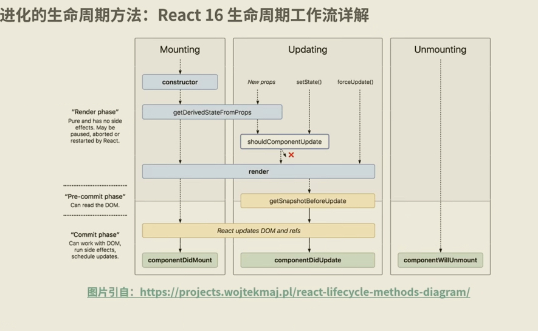

在jsx的介绍中，我们提到，渲染分为diffing阶段(或者叫render阶段)和commit阶段。这其实与react的生命周期息息相关。这里我们从React15到React16介绍react生命周期方法的演变。

## 一、react15生命周期方法
下图展示了react组件挂载和组件更新到组件卸载的流程：
 
这里介绍其中几个需要特别注意的生命周期方法：
1. componentDidMount: 真实DOM已经挂载到页面上，可以执行真实DOM操作；
2. componentWillReceiptProps: 父组件更新就会触发子组件的componentWillReceiptProps，并不是单纯由props变化触发；
3. shouldComponentUpdate: react会根据shouldComponentUpdate的返回值决定是否执行该方法之后的生命周期，即是否对组件进行重渲染(与react性能有关联)；
4. componentWillUnmount: 该生命周期方法就是在组件卸载时调用的。需要知道的是，组件销毁的触发有两种情况：
    1) 组件在父组件中被移除；
    2) 组件中设置了key，父组件在render过程中，发现key值发生了变化。

这里提供一个例子，便于观看react15的生命周期方法的调用，代码如下：
```jsx
import React from 'react';
import ReactDOM from 'react-dom';

// 定义子组件
class LifeCircel extends React.Component {
    constructor(props) {
        console.log('进入constructor');
        super(props);
        // state 可以在 constructor 里初始化
        this.state = {text: '子组件的文本'};
    }
    // 初始化渲染时调用
    componentWillMount() {
        console.log('componentWillMount方法执行');
    }
    // 初始化渲染后调用
    componentDidMount() {
        console.log('componentDidMount方法执行');
    }
    // 父组件修改组件的props时调用
    componentWillReceiptProps() {
        console.log('componentWillReceiptProps方法执行');
    }
    // 组件更新时调用
    shouldComponentUpdate(nextProps, nextState) {
        console.log('shouldComponentUpdate方法执行');
        return true;
    }
    // 组件更新时调用
    componentWillUpdate(nextProps, nextState) {
        console.log('componentWillUpdate方法执行');
    }
    // 组件更新后调用
    componentDidUpdate(nextProps, nextState) {
        console.log('componentDidUpdate方法执行');
    }
    // 组件卸载时调用
    componentWillUnmount() {
        console.log('组件componentWillUnmount方法执行');
    }

    changeText = () => {
        this.setState({text: '修改后的子组件文本'});
    };

    render() {
        console.log('render方法执行');
        return (
            <div className='container'>
                <button onClick={this.changeText}>修改子组件文本</button>
                <p className='textContent'>{this.state.text}</p>
                <p className='fatherContent'>{this.props.text}</p>
            </div>
        );
    }
}

// 定义父组件
class LifeCircleContainer extends React.Component {
    state = {
        text: '父组件的文本',
        hideChild: false
    };

    changeText = () => {
        this.setState({
            text: '修改后的父组件文本'
        });
    };

    hideChild = () => {
        this.setState({
            hideChild: true
        });
    };

    render() {
        return (
            <div className='fatherContainer'>
                <button onClick={this.changeText} className='changeText'>
                    修改父组件内容
                </button>
                <button onClick={this.hideChild} className='hideChild'>
                    隐藏子组件
                </button>
                {this.state.hideChild ? null : <LifeCircle text={this.state.text} />}
            </div>
        );
    }
}

ReactDOM.render(<LifeCircleContainer />, document.getElementById('root'));
```

## 二、react16生命周期方法
下面这张图就是react16的生命周期工作流程图。可以看出，渲染过程主要分为两部分：render阶段和commit阶段(前面还有个pre-commit阶段)。

为了直观地对比react15和react16在生命周期方法上的差异。这里，我们从组件挂载和组件更新两个维度分别对比一下，并介绍一下几个重要的变动。如下：
# 1、组件挂载
 

1. getDerivedStateFromProps：react16在挂载阶段，废弃了componentWillMount，新增了getDerivedStateFromProps。实际上，getDerivedStateFromProps的真实目的不是为了取代挂载阶段的componentWillMount，而是取代更新阶段的componentWillReceiptProps。区别在于，getDerivedStateFromProps是真正作用由props派生/更新state，也就是说props的改变会触发该生命周期方法。前面提到的componentWillReceiptProps是只要父组件更新就会触发子组件的componentWillReceiptProps，有点愚蠢。另一方面，getDerivedStateFromProps在组件挂载阶段也会触发，也就是props派生阶段，从而也很好地取代了componentWillMount的功能。  

语法：`static: getDerivedStateFromProps(props, state)`，getDerivedStateFromProps需要注意以下几点：
    (1) 它是一个静态方法，所以是无法访问this的，避免拿到组件实例this进行this.fetch、this.setState等各种不合理的且可能产生副作用的操作;
    (2) 它接受的参数是父组件传入的props和当前组件的state;
    (3) 它需要一个对象格式的返回值，react使用它更新组件的state。如果我们不需要使用props派生/更新state，那其实就不应该使用getDerivedStateFromProps，或者就return null。
react16试图强制推行“只用getDerivedStateFromProps来完成props到state的映射”。

# 2、组件更新

2. getSnapshotBeforeUpdate: react16删除了render前的componentWillUpdate方法，增加了render后的getSnapshotBeforeUpdate，在componentDidUpdate之前执行。

语法：`getSnapshotBeforeUpdate(prevProps, prevState){}`，它的返回值会作为第三个参数给到componentDidUpdate。由于是在render方法之后，所以该阶段可以获取到更新前的真实DOM和*更新前后的state&props信息*。

同样，这里提供一个示例，便于观看react16的生命周期方法的调用，代码如下：
```jsx
import React from 'react';
import ReactDOM from 'react-dom';

// 定义子组件
class LifeCircel extends React.Component {
    constructor(props) {
        console.log('进入constructor');
        super(props);
        // state 可以在 constructor 里初始化
        this.state = {text: '子组件的文本'};
    }
    // 初始化/更新时调用
    static getDerivedStateFromProps(props, state) {
        console.log('getDerivedStateFromProps方法执行');
        return {
            fatherText: props.text // 定向更新LifeCircel的state的fatherText属性。
        }
    }
    // 初始化渲染后调用
    componentDidMount() {
        console.log('componentDidMount方法执行');
    }
    // 组件更新时调用
    shouldComponentUpdate(nextProps, nextState) {
        console.log('shouldComponentUpdate方法执行');
        return true;  // 只有它返回boolean类型，可以控制组件是否更新
    }
    // 组件更新时调用
    getSnapshotBeforeUpdate(prevProps, prevState) {
        console.log('getSnapshotBeforeUpdate方法执行');
        return 'haha';
    }
    // 组件更新后调用
    componentDidUpdate(nextProps, nextState, valueFromSnapShot) {
        console.log('componentDidUpdate方法执行');
        console.log('从getSnapshotBeforeUpdate获取到的值', valueFromSnapShot); // getSnapshotBeforeUpdate返回第三个参数
    }
    // 组件卸载时调用
    componentWillUnmount() {
        console.log('组件componentWillUnmount方法执行');
    }

    changeText = () => {
        this.setState({text: '修改后的子组件文本'});
    };

    render() {
        console.log('render方法执行');
        return (
            <div className='container'>
                <button onClick={this.changeText}>修改子组件文本</button>
                <p className='textContent'>{this.state.text}</p>
                <p className='fatherContent'>{this.props.text}</p>
            </div>
        );
    }
}

// 定义父组件
class LifeCircleContainer extends React.Component {
    state = {
        text: '父组件的文本',
        hideChild: false
    };

    changeText = () => {
        this.setState({
            text: '修改后的父组件文本'
        });
    };

    hideChild = () => {
        this.setState({
            hideChild: true
        });
    };

    render() {
        return (
            <div className='fatherContainer'>
                <button onClick={this.changeText} className='changeText'>
                    修改父组件内容
                </button>
                <button onClick={this.hideChild} className='hideChild'>
                    隐藏子组件
                </button>
                {this.state.hideChild ? null : <LifeCircle text={this.state.text} />}
            </div>
        );
    }
}

ReactDOM.render(<LifeCircleContainer />, document.getElementById('root'));
```

## 三、初识Fiber架构
上面提到了react16对生命周期方法进行了大幅的调整。一方面是优化了react15生命周期方法的不合理之处，另一方面，这种改变是与Fiber架构紧密关联的。简单来说，Fiber会使原本同步的渲染变成异步的。  

我们知道，浏览器是多线程的，要处理JavaScript线程和UI渲染线程等。react是单线程的。**UI渲染线程执行的时候，JavaScript线程是暂停的**。因为JavaScript线程是可以处理DOM的，如果在多线程的浏览器中，在UI渲染过程中，JavaScript线程仍然在修改DOM，就会造成渲染结果难以预测。  

react每次进行组件更新，都会构建一个新DOM，与旧DOM进行Diffing递归比较。递归比较很深，且只有当最深成的对比开始返回，渲染才一层一层往上开始执行。在react16之前，整个渲染过程是同步的，会一直占用不放主线程，直到递归完成。这导致页面渲染阶段无法进行其他操作。react16引入Fiber架构，Fiber会将一个大的更新任务拆解为多个小任务，这样就可以多次释放主线程，来执行更高优先级的任务。

Fiber架构的重要特征就是可以被多次打断的异步渲染模式。根据“能否被打断”这一标准，react16生命周期被划分为render(可打断)和commit阶段(不可打断，同步执行)。每个阶段的能力在'react16生命周期.jpg'图中有标注。
1. render阶段：纯净且无副作用，是可以被react暂停、中止或重新启动；
2. pre-commit阶段：可以读取DOM；
3. commit阶段：可以使用DOM，运行副作用，安排更新。

react16中，render阶段的生命周期方法都是可能重复执行的。废弃的生命周期方法如下：
1. componentWillMount;
2. componentWillUpdate;
3. componentWillReceiptProps
这些生命周期方法都是render阶段可能被重复执行的，且经常被滥用的，进行各种不合理的操作。react16收回了这些生命周期方法，避免了各种bug的产生。同时，也提供了**功能完全可控的getDerivedStateFromProps方法**给我们在render阶段使用。

这里要说明一下，react16后虽然使用Fiber重写了react核心算法，优化了新旧DOM的对比过程(即优化了调和，reconciliation)。最终实现任务的“可中断”、“可恢复”和“优先级”。如下图所示： 


值得注意的是，react16提供了多个启动模式，如下所示：
1. legacy模式：ReactDOM.render(<App />, rootNode)，不支持Fiber异步更新的新功能
2. blocking模式：ReactDOM.createBlockingRoot(rootNode).render(<App />)，中间模式
3. concurrent模式：ReactDOM.createRoot(rootNode).render(<App />)，最终的默认开发模式，开启Fiber所有新功能

## 参考
1. [react知识链路和底层逻辑](https://www.youtube.com/watch?v=EVFZazcxAbo)
2. [react规避误操作](https://zh-hans.reactjs.org/blog/2018/06/07/you-probably-dont-need-derived-state.html)