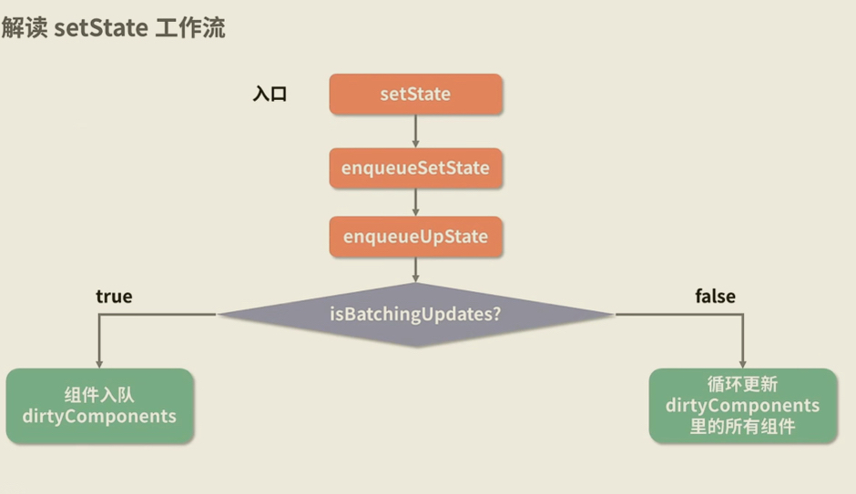

通常，我们会理解 setState 是异步更新，即setState设置的值会在下一次组件渲染的时候生效。这里我们先给出一个代码示例：
```jsx
import React from 'react';
import './styles.css';
export default class App extends React.Component {
    state = {
        count: 0
    };

    increment = () => {
        console.log('increment前：', this.state.count);
        this.setState({
            count: this.state.count + 1
        });
        console.log('increment后：', this.state.count);
    };

    triple = () => {
        console.log('triple前：', this.state.count);
        this.setState({
            count: this.state.count + 1
        });
        this.setState({
            count: this.state.count + 1
        });
        this.setState({
            count: this.state.count + 2
        });
        console.log('triple后：', this.state.count);
    };

    reducer = () => {
        // 增加了setTimeout
        setTimeout(() => {
            console.log('reducer前：', this.state.count);
            this.setState({
                count: this.state.count - 1
            });
            console.log('reducer后：', this.state.count);
        });
    };

    render() {
        return (
            <div>
                <button onClick={this.increment}>增加</button>
                <button onClick={this.triple}>增加3</button>
                <button onClick={this.reducer}>减小</button>
            </div>
        );
    }
}
```
依次点击按钮，结果如下：
```
increment前：0
increment后：0
triple前：1
triple后：1
reducer前：3
reducer后：1
```

## 一、react15下的setState机制
上面代码需要解释3个问题：
# 1、为什么increment前后都是0？
这个原因倒是好理解，setState是异步方法，所以setState后的值还没有更新。

# 2、为什么执行reducer前的count不是5，而是3？
我们知道，react有批量更新的能力，如下所示：
```jsx
this.setState({
    count: this.state.count + 1   ===> 入队， [count + 1 的任务]
});
this.setState({
    count: this.state.count + 1   ===> 入队， [count + 1 的任务, count + 1 的任务]
});
this.setState({
    count: this.state.count + 2   ===> 入队， [count + 1 的任务, count + 1 的任务, count + 2 的任务]
});
                                                  ｜
                                                合并state，依次执行这3个任务
                                                  ｜
                                                count在此期间一直为1，执行最后一个[count + 2]，结果为3
```
即使这里triple代码里执行100次setState，最后整合在一起执行，结果相当于执行了最后一次setState。

# 3、为什么reducer里的setState是同步更新的？
这里给出一个结论，**setState帮助 setState“逃脱”了react对它的管控。只要是在 React 管控下的setState，一定是异步的**。这里给出react15的setState源码的思想，如下图所示：


react源码中，是通过isBachingUpdates来管控批量更新，isBachingUpdates设置为true，就表示开启批量更新。发起批量更新是调用batchedUpdates方法。batchedUpdates执行会先把isBachingUpdates设置为true，表明现在正处于批量更新中，此时任何需要更新的组件都只能进入dirtyComponent里，等候下一次的批量更新。这是react面对大量状态，仍然可以做到有序分批处理的机制。事实上，react在渲染时调用batchedUpdated的情况只有两种：  
1. 一是首次渲染组件的时候，考虑到各个生命周期内都可能会进行setState，所以会调用batchedUpdated让所有setState都进入dirtyComponent中，来确保初始渲染流程的所有setState都会生效；
2. 组件绑定了事件，处理事件过程中，也可能会进行setState操作，react也会开启批量更新。

上面示例异步和同步更新的原因如下：
```jsx
increment = () => {
    // 进来先锁住
    isBatchingUpdates = true;
    console.log('increment前：', this.state.count);
    this.setState({
        count: this.state.count + 1
    });
    console.log('increment后：', this.state.count);
    // 执行完函数再放开
    isBatchingUpdates = false;
};

reducer = () => {
    // 进来先锁住
    isBatchingUpdates = true;
    // 增加了setTimeout
    setTimeout(() => {
        console.log('reducer前：', this.state.count);
        this.setState({
            count: this.state.count - 1
        });
        console.log('reducer后：', this.state.count);
    });
    // 执行完函数再放开
    isBatchingUpdates = false;
};
```
reducer中isBatchingUpdates是在同步代码中执行的，setTimeout是异步的。当setTimeout里开始执行的时候，此时isBatchingUpdates已经被设置成了false，所以没有开启批量更新，就会立刻更新。

总的来说，setState的表现因场景而不同：
1. 在react钩子函数及合成事件中，它表现为*异步*；
2. 在setTimeout、setInterval等异步函数中包括原声事件中，它都表现为*同步*。
