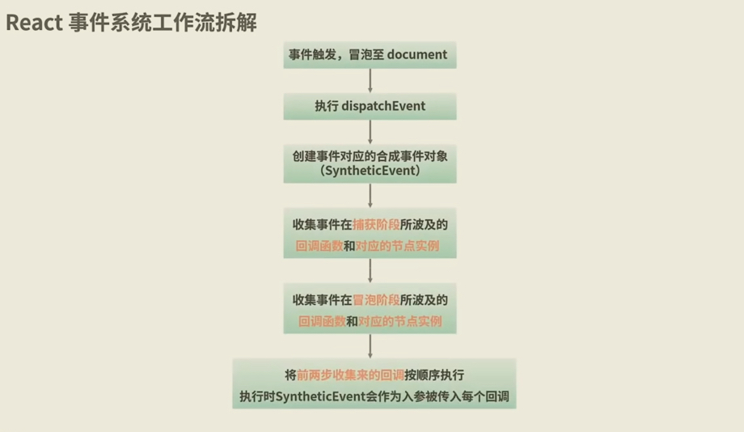

背景：`react` 和 `react-native` 都是由 Facebook 开发的，用于构建用户界面的库和框架。尽管它们在很多方面相似，但在事件响应机制上有一些关键的区别。react 中的事件是基于合成事件系统实现的，它遵循了浏览器的事件冒泡机制。`react-native` 则是直接作为原生事件处理。这会导致对同一个功能如点击时，处理上有所差异，`react`需要更多地考虑冒泡带来的问题，同时也要考虑是否可以基于事件冒泡进行代码优化如事件委托等。

### 一、JavaScript 的事件机制
首先说明一下，事件的捕获和冒泡是 JavaScript 的事件机制，JavaScript 的事件模型是基于 DOM（文档对象模型）。在原生 JavaScript 中，事件传播分为三个阶段：

1. 事件捕获阶段（Capture Phase）：事件从文档根节点向目标元素传播。
2. 目标阶段（Target Phase）：事件到达目标元素。
3. 事件冒泡阶段（Bubble Phase）：事件从目标元素向文档根节点传播。 

  

## 1、目标元素

“目标”指的是触发事件的具体元素。注意，目标是唯一的，不会出现一个操作针对的是多个目标，比如我不能一个点击是要触发左右两个按钮的操作。

你可能疑惑，既然目标是唯一的，为什么要整这个冒泡功能，还可能引起非目标元素响应事件。像`react-native`那样没有冒泡不行吗？其实主要是灵活性。`react`有了这个事件机制，更加灵活，比如可以进行事件委托以及统一处理等。

## 2、事件传播  

你可以通过`addEventListener`方法的第三个参数来指定事件处理程序是在捕获阶段还是冒泡阶段执行：
```js
element.addEventListener('click', eventHandler, true); // 捕获阶段
element.addEventListener('click', eventHandler, false); // 冒泡阶段
```
*注意:*  

*（1）*这里的`element`可以是任何元素，只要该`click`事件经过该元素，就可以被监听到。这里“经过”可以参考上面事件传递图，事件会经过`html`、`body`和`div1`元素，但是不会经过`div2`、`div3`和`input`。再看下面例子，事件冒泡只会在目标元素及其祖先元素之间传播，不会传播到兄弟元素。
```js
return (
  <div id="topElement">
    <div id="parentElement">
      <button id="childElement" onclick="handleChildClick()">
        点击
      </button>
    </div>
    <button id="subElement" />
  </div>
);
// 路径图
parentRef
  ├── div
  │   └── childRef
  └── subRef
```
目标元素为`childElement`的点击事件，会冒泡会冒泡到`parentElement`和`topElement`，但是不会冒泡到`subElement`，因为`subElement`是`parentElement`的兄弟元素。

*（2）*添加监听的方式有多种。一方面，我们可以通过`addEventListener`显式添加监听；其次，使用内联事件处理器、使用元素事件、使用事件委托等隐形方式，也会添加监听。下面会详解介绍。

*（3）*在事件冒泡阶段，可以使用`e.stopPropagation()` 或者 `e.cancelBubble=true`（IE）来阻止事件的冒泡传播。下面也会详细介绍。

## 3、添加监听的方式

1. 使用 addEventListener
这是最常用和推荐的方法，因为它允许你为同一个事件添加多个监听器，并且可以指定事件的捕获或冒泡阶段。
```js
const element = document.getElementById('myElement');
element.addEventListener('click', function(event) {
    console.log('Element clicked!');
});
```
2. 使用内联事件处理器
在 HTML 中直接使用事件属性。这种方法较为简单，但不推荐，因为它与 HTML 结构混合在一起，不利于代码的可维护性。
```js
<button id="myElement" onclick="handleClick()">Click me!</button>

<script>
function handleClick() {
    console.log('Button clicked!');
}
</script>
```
3. 使用元素的事件属性
直接在 JavaScript 中设置元素的事件属性。这种方法只能为每个事件类型设置一个监听器，后设置的会覆盖先前的。
```js
const element = document.getElementById('myElement');
element.onclick = function(event) {
    console.log('Element clicked!');
};
```
4. 使用事件委托
事件委托是一种将事件监听器添加到父元素上，通过事件冒泡机制来处理子元素的事件的方法。适用于需要处理大量子元素事件的情况。
```js
<div id="parent">
    <button class="child">Button 1</button>
    <button class="child">Button 2</button>
</div>

<script>
const parent = document.getElementById('parent');
parent.addEventListener('click', function(event) {
    if (event.target && event.target.classList.contains('child')) {
        console.log('Child button clicked!');
    }
});
</script>
// 这里就是父组件parent上添加监听，来监听子组件button的的click事件并进行处理。
```
事件委托的核心思想是利用事件冒泡机制，将事件监听器添加到父元素上，从而捕获并处理子元素的事件。

5. 使用第三方库或框架
许多 JavaScript 库和框架（如 jQuery、React、Vue 等）提供了简化的事件绑定方法。例如，使用 jQuery：
```js
<script src="https://code.jquery.com/jquery-3.6.0.min.js"></script>
<script>
$(document).ready(function() {
    $('#myElement').on('click', function() {
        console.log('Element clicked!');
    });
});
</script>
```

### 二、react事件机制

你是否有一个疑惑，如下代码，我们既没有手动添加监听，也没有使用内联事件处理器等，仅仅用了JSX方式处理onClick方法，为什么父组件还会受到子组件冒泡事件的影响，触发handleClose呢？
```js
const handleClose = (event: MouseEvent<HTMLDivElement>) => {
  if (event.target === event.currentTarget) {
    console.log('222');
  }
};
const handleSubClose = (event: MouseEvent<HTMLDivElement>) => {
    console.log('111');
    // event.stopPropagation(); // 阻止事件冒泡
};
<div className="pop-box" onClick={handleClose}>
  <div className="pop-sub" onClick={handleSubClose}></div>
</div>
```
这是因为 `react` 在幕后为你处理了事件监听的注册和管理。具体来说，`react` 会在组件挂载时为你注册事件监听器，并在事件触发时调用你定义的处理器。上面代码，`react` 会在底层为这个div注册一个点击事件监听器，并在点击事件发生时调用`handleClose`函数。下面详细介绍一下`react`事件机制。  

`react`的事件处理机制与传统的 DOM 事件处理有所不同。它使用了一种称为“合成事件”（Synthetic Events）的系统，这种系统在性能和跨浏览器兼容性方面提供了许多优势。

## 1、JSX中的事件处理器

在`react`中，通过 JSX 语法在组件中定义事件处理函数，比如onClick这其实是加了该合成事件的监听器。**所以，无论是通过内联形式还是JSX形式，只要你在元素上定义了事件处理函数，都会在该元素上添加一个事件监听器。**没有监听，事件处理函数永远无法触发，就没有存在的意义了。

```js
const handleClose = (event: MouseEvent<HTMLDivElement>) => {
  if (event.target === event.currentTarget) {
    console.log('222');
  }
};
<div className="pop-box" onClick={handleClose}></div>
```

## 2、react合成事件系统

react使用“合成事件系统”来处理事件，这些合成事件是react对原生 DOM 事件的封装。比如，在`react`中，我们绑定的事件`onClick`等，并不是原生事件，而是由原生事件合成的`react`事件。

# (1) 合成事件系统的工作流程

1. **事件代理：**`react`将所有“合成事件”监听器集中附加到根元素上（如document或root节点），而不是每个具体的 DOM 元素。这种方式称为事件代理。相当于，`react`合成事件默认使用了事件委托。另外，在组件卸载（unmount）阶段，`react`会自动销毁它绑定的事件。这里需要注意的是，`react`事件委托是对自己的合成事件，而不针对 JavaScript 原生事件。比如`onClick`合成事件会被委托到`document`上，但是`parent.addEventListener('click',()=>{})`是监听原生事件，不会被`react`委托到`document`上。

2. **事件分发：**当合成事件触发时，`react`会通过事件代理捕获事件，并根据事件类型来分发事件。事件冒泡过程还会带上事件的目标元素（target属性）和当前处理事件的元素（currentTarget属性）等信息，以便于访问事件的目标元素，从而执行特定的操作。

3. **调用处理器：**`react`找到匹配的处理器，并调用这些处理器。

**原生事件是直接绑定到指定的 DOM 元素上，在事件到达元素时被捕获并处理事件，合成事件是冒泡到document上才开始处理事件。（react会模拟的冒泡过程，以确保事件处理程序按照预期的顺序执行）。**

# (2) 合成事件包含的内容
以 react 的 MouseEvent 合成事件为例，包含了以下几个主要部分：  

**基础事件属性：**

1. type: 事件类型，例如 click、dblclick、mousedown、mouseup、mousemove 等。
2. target: 事件的目标元素。
3. currentTarget: 事件当前处理的元素。
4. eventPhase: 事件传播的阶段。
5. bubbles: 事件是否冒泡。
6. cancelable: 事件是否可以取消。
7. defaultPrevented: 是否调用了 preventDefault() 方法。
8. isTrusted: 事件是否是用户触发的。
9. nativeEvent: **原生事件**

**鼠标事件特有的属性：**

1. altKey: 是否按下了 Alt 键。
2. button: 按下的鼠标按钮（0：左键，1：中键，2：右键）。
3. buttons: 按下的鼠标按钮的状态。
4. clientX: 鼠标指针相对于浏览器窗口的水平坐标。
5. clientY: 鼠标指针相对于浏览器窗口的垂直坐标。
6. ctrlKey: 是否按下了 Ctrl 键。
7. metaKey: 是否按下了 Meta 键（在 Mac 上是 Command 键）。
8. pageX: 鼠标指针相对于文档的水平坐标。
9. pageY: 鼠标指针相对于文档的垂直坐标。
10. relatedTarget: 与事件相关的次要目标元素（例如鼠标移入和移出事件）。
11. screenX: 鼠标指针相对于屏幕的水平坐标。
12. screenY: 鼠标指针相对于屏幕的垂直坐标。
13. shiftKey: 是否按下了 Shift 键.

**方法:**

1. preventDefault(): 阻止默认行为。
2. stopPropagation(): 阻止事件冒泡。
3. persist(): 保留合成事件对象，防止其被回收。

```js
import React from 'react';

class MyComponent extends React.Component {
  handleClick = (syntheticEvent) => {
    // 访问合成事件的属性
    console.log('合成事件类型:', syntheticEvent.type);
    // 访问原生事件的属性
    console.log('原生事件类型:', syntheticEvent.nativeEvent.type);
  }

  render() {
    return (
      <button onClick={this.handleClick}>
        点击我
      </button>
    );
  }
}

export default MyComponent;
```
首先，合成事件是包含原生事件`nativeEvent`的，而且`nativeEvent`包含的很多属性，而且很多都与合成事件是一样的。所以，简单理解合成事件就是`react`对原生事件`nativeEvent`进行了再次包装。

其次，合成事件与原生事件很多是一一映射的。比如：很多时候，鼠标事件`onClick -> click；onDoubleClick -> dblclick；键盘事件onKeyDown -> keydown；表单onFocus -> focus；UI事件onScroll -> scroll`等等这些是对应。
但是，合成事件`onChange`往往对应的是原生`input`事件，而不是原生`change`事件。原生 `input` 事件在 <input> 和 <textarea> 元素中，每当用户输入内容时，这个事件都会立即触发；原生 `change` 事件在 <input> 和 <textarea> 元素中，只有当元素失去焦点（即用户完成输入并离开输入框）时，这个事件才会触发。
还有合成事件`onDoubleClick`，对应于原生的 `dblclick` 事件，但在某些浏览器中，`dblclick` 事件可能会有不同的触发条件和行为。还有，在 `react` 中，`onFocus` 和 `onBlur` 事件是冒泡的，而原生的 `focus` 和 `blur` 事件并不会冒泡，`react` 通过合成事件系统处理了这些差异，使得 `onFocus` 和 `onBlur` 事件在 `react` 中可以冒泡。

**从这里，也可以看出合成事件对不同浏览器、不同事件做的兼容处理，对开发者提供一套简单且一致的事件体系。**

## 3、 原生事件与合成事件常见的区别
(参考文献1)  

1. 事件绑定
DOM原生事件通过addEventListener或者直接在HTML元素上绑定事件处理函数，而react事件则是通过JSX中onClick、onChange等属性上直接绑定事件处理函数。
2. 事件监听
（1）DOM默认事件监听器只绑定在目标元素上；也可以手动进行事件委托，在其父组件上也绑定事件监听器。  

（2）react事件是统一绑定在根元素上的。react项目中对同一个事件进行多次监听，也只会在根节点上触发一次注册。因为react最终注册在根节点上的不是某一个DOM节点上对应的具体回调逻辑，而是一个统一的事件分发函数。事件分发过程会在Fiber树上来收集事件捕获和冒泡阶段涉及到的所有回调函数和节点实例，放入数组中。如下图所示：


3. 阻止默认行为
在原生事件中，可以通过返回 false 方式来阻止默认行为，但是在 React 中，需要显式使用 preventDefault() 方法来阻止。这里以阻止 <a> 标签默认打开新页面为例，介绍两种事件区别：
```js
// 原生事件阻止默认行为方式
<a href="https://www.123.com" 
  onclick="console.log('阻止原生事件~'); return false"
>
  阻止原生事件
</a>

// react 事件阻止默认行为方式
const handleClick = e => {
  e.preventDefault();
  console.log('阻止原生事件~');
}
const clickElement = <a href="https://www.123.com" onClick={handleClick}>
  点击
</a>
``` 

4. 事件监听器优先级
不难理解，react事件监听器的触发顺序晚于DOM原生事件的，因为react事件是通过根容器的捕获/冒泡阶段触发的。

### 三、事件执行顺序&阻止事件传播

想要阻止事件传播，首先要了解事件执行的顺序，前面已经介绍了原生事件和合成事件的传播和监听逻辑了，下面举例说明一下。

## 1、事件执行顺序

这里先举个例子（运行：https://codesandbox.io/p/sandbox/zaixiandaimabianjiqi-sv1eq?file=%2Fsrc%2Findex.js）：  
```ts
import React from "react";
import ReactDOM from "react-dom";

class App extends React.Component<any, any> {
  parentRef: any;
  childRef: any;
  constructor(props: any) {
    super(props);
    this.parentRef = React.createRef();
    this.childRef = React.createRef();
  }
  componentDidMount() {
    console.log("React componentDidMount！");
    this.parentRef.current?.addEventListener("click", () => {
      console.log("原生事件：父元素 DOM 事件监听！");
    });
    this.childRef.current?.addEventListener("click", () => {
      console.log("原生事件：子元素 DOM 事件监听！");
    });
    document.addEventListener("click", (e) => {
      console.log("原生事件：document DOM 事件监听！");
    });
  }
  parentClickFun = () => {
    console.log("React 事件：父元素事件监听！");
  };
  childClickFun = () => {
    console.log("React 事件：子元素事件监听！");
  };
  render() {
    return (
      <div ref={this.parentRef} onClick={this.parentClickFun}>
        <div ref={this.childRef} onClick={this.childClickFun}>
          分析事件执行顺序
        </div>
      </div>
    );
  }
}
export default App;

const rootElement = document.getElementById("root");
ReactDOM.render(<App />, rootElement);
```
执行结果如下：  
React componentDidMount！
原生事件：子元素 DOM 事件监听！ 
原生事件：父元素 DOM 事件监听！ 
React 事件：子元素事件监听！ 
React 事件：父元素事件监听！ 
原生事件：document DOM 事件监听！

**分析如下：**   

第一，`addEventListener`这是监听原生事件，所以在事件到达目标元素时，执行事件处理程序；`onClick`这是监听合成事件，会冒泡到`document`后，再处理`react`合成事件。所以，两个“原生事件”在两个“React 事件”之前执行。  

第二，`this.parentRef.current?.addEventListener("click", () => {});`等同于`this.parentRef.current?.addEventListener("click", () => {}, false);`，是监听事件冒泡阶段。如果改为`this.parentRef.current?.addEventListener("click", () => {}, true);`则是监听事件捕获阶段。  

我们对上述代码，增加捕获阶段的监听，如下所示：
```js
this.parentRef.current?.addEventListener("click", () => {
      console.log("原生事件：父元素 DOM 事件监听！ggg");
}, true);
this.childRef.current?.addEventListener("click", () => {
      console.log("原生事件：子元素 DOM 事件监听冒泡！ggg");
}, true);
```
执行结果如下：   

原生事件：父元素 DOM 事件监听！ggg
原生事件：子元素 DOM 事件监听！ggg
原生事件：子元素 DOM 事件监听！ 
原生事件：父元素 DOM 事件监听！ 
React 事件：子元素事件监听！ 
React 事件：父元素事件监听！ 
原生事件：document DOM 事件监听！ 

第三，值得注意的是，`document` 原生事件监听程序，是其子组件的`react`事件之后执行的。

## 2、阻止事件传播
原生JavaScript可以通过return false的方式阻止事件传播。这里介绍的是react阻止事件传播的方式，方法如下：

1. event.stopPropagation()：阻止事件继续传播；
2. event.stopImmediatePropagation()：阻止事件传播，并阻止当前元素上剩余的事件监听器被调用；
3. event.preventDefault()：阻止事件的默认行为（例如，阻止表单提交或链接跳转）。  

# (1) 示例
```js
function App() {
    useEffect(() => {
        document.addEventListener("click", () => console.log('document clicked'));
    }, []);
    function handleClick(event) {
        event.stopPropagation();
        console.log("btn clicked");
    }
    return <button onClick={handleClick}>CLICK ME</button>;
};
ReactDOM.render(<App />, document.getElementById('root'));
```
这段代码，在`react16`中，`event.stopPropagation();`没有阻止`document clicked`的执行，而在`react17`中阻止了。原因是`react16`，事件是委托到`document`上，而`react17`开始，就委托到了`root`节点上。


### 四、react-native事件机制
`react-native`都是封装好的组件，对外提供事件处理方法，比如`onPress、onChangeText、onScroll`等，只会针对当前组件，不存在冒泡问题。同时，`react-native`提供了一个更底层的手势响应系统，允许你更精细地控制触摸事件。你可以使用`onStartShouldSetResponder、onMoveShouldSetResponder、onResponderGrant、onResponderMove、onResponderRelease`等方法。此外，对于更复杂的手势处理，可以使用第三方库，如react-native-gesture-handler和react-native-reanimated。这些库提供了更强大的手势处理和动画功能。

## 参考文献

1. [React事件机制](https://juejin.cn/post/7068649069610024974)

