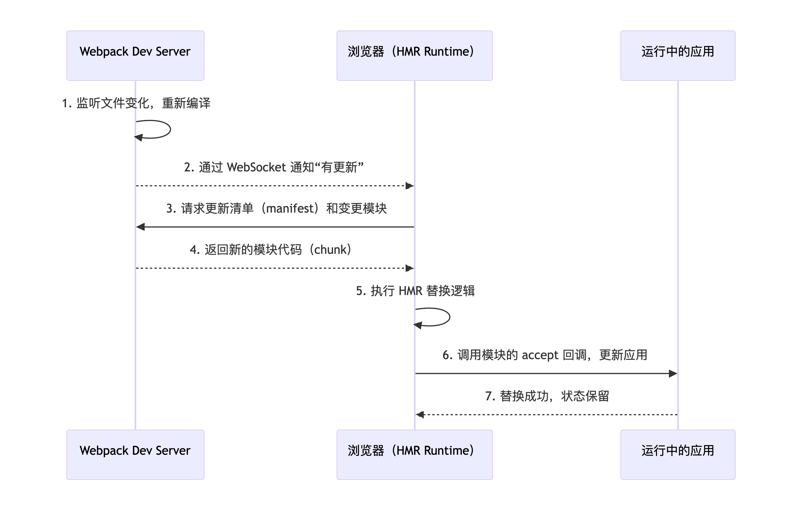

# Webpack 完全理解指南

---

## 一、Webpack 的本质与解决的问题

### 1.1 问题背景

早期前端开发缺乏模块化，多个 `<script>` 标签引入 JS 导致：
- 全局变量污染
- 依赖顺序需要手动维护
- 模块间难以复用

后来出现 CommonJS（Node.js）、AMD、CMD 等规范，以及 Browserify 等打包工具，但它们只能做简单的 JS 模块拼接。

### 1.2 Webpack 的核心创新

**Webpack 是一个静态模块打包工具**。它有两个关键设计：

1. **一切皆模块**：不仅 JavaScript，CSS、图片、字体等所有资源都可以被视为模块。
2. **可扩展的编译管道**：通过 **Loader** 转换单个文件，通过 **Plugin** 介入整个构建生命周期。

因此，Webpack 的本质是一个**可扩展的、面向现代前端工程的构建平台**。

---

## 二、核心工作流程（从源码到产物）


### 详细步骤

1. **初始化**：读取 `webpack.config.js`，注册插件，创建 `Compiler` 对象。
2. **解析入口**：从入口文件（entry）开始读取文件内容。
3. **Loader 转换**：对非 JS 文件（如 `.css`、`.png`）应用配置的 loader，将其转为 JS 可识别的模块（例如 `css-loader` 将 CSS 转为 JS 字符串）。
4. **构建依赖图**：分析文件中的 `import`/`require`，递归找到所有依赖，形成一个依赖图（Dependency Graph）。
5. **分块（Chunk）**：根据入口配置及 `splitChunks` 规则，将依赖图切分成多个 chunk。
6. **插件优化**：插件监听 Webpack 生命周期事件，对 chunk 进行优化（压缩、抽离 CSS、注入环境变量等）。
7. **输出**：将最终 chunk 写入文件系统（dist 目录）。

**关键理解**：
- Loader 工作在**单个文件级别**，负责格式转换。
- Plugin 工作在整个构建流程的**特定时机**，可以影响多个文件甚至全局输出。

---

## 三、Loader 深度解析

### 3.1 为什么需要 Loader？

Webpack 原生只理解 JavaScript 和 JSON。要处理 CSS、TypeScript、图片等，必须通过 Loader 将其“翻译”成 JS 模块。

### 3.2 Loader 的工作原理

Loader 是一个导出为函数的 Node 模块，接收源文件内容，返回新的内容（通常是 JS 代码）。

```javascript
// 一个简单的 loader：将文件内容反转
module.exports = function(source) {
  const reversed = source.split('').reverse().join('');
  return `module.exports = ${JSON.stringify(reversed)}`;
};
```

**链式调用**：多个 loader 可以串联，从右向左执行。

```javascript
module: {
  rules: [
    {
      test: /\.css$/,
      use: ['style-loader', 'css-loader'] 
      // 1. css-loader 解析 CSS 为 JS 模块
      // 2. style-loader 将 CSS 插入 DOM
    }
  ]
}
```

### 3.3 常见 Loader 分类

| 类别 | 示例 | 作用 |
|------|------|------|
| 样式 | `css-loader`, `style-loader`, `sass-loader` | 处理 CSS/SCSS |
| 脚本 | `babel-loader`, `ts-loader` | 转换 ES6+/TypeScript |
| 静态资源 | `file-loader`, `url-loader` | 处理图片、字体等 |
| 数据 | `csv-loader`, `xml-loader` | 处理 CSV/XML |

**面试深挖**：`babel-loader` 与 `ts-loader` 的区别？
- `ts-loader` 调用 TypeScript 编译器，会做类型检查。
- `babel-loader` 配合 `@babel/preset-typescript` 仅移除类型，不做类型检查（更快），但需要配合 `fork-ts-checker-webpack-plugin` 检查类型。

---

## 四、Plugin 深度解析

### 4.1 为什么需要 Plugin？

Loader 只能处理单个文件，而 Plugin 可以监听 Webpack 整个构建生命周期，执行更广泛的任务：优化、资源管理、环境变量注入等。

### 4.2 Plugin 的工作原理

Plugin 是一个类，包含 `apply(compiler)` 方法。Webpack 内部基于 [tapable](https://github.com/webpack/tapable) 实现事件流，Plugin 通过 `compiler.hooks.xxx.tap` 注册钩子。

```javascript
class MyPlugin {
  apply(compiler) {
    compiler.hooks.emit.tap('MyPlugin', (compilation) => {
      // 在输出资源之前修改 compilation.assets
      console.log('资源将要输出');
    });
  }
}
```

### 4.3 常见 Plugin

| Plugin | 作用 |
|--------|------|
| `HtmlWebpackPlugin` | 生成 HTML 并自动注入 bundle |
| `MiniCssExtractPlugin` | 抽离 CSS 为独立文件 |
| `DefinePlugin` | 定义全局常量（如 `process.env.NODE_ENV`） |
| `TerserWebpackPlugin` | 压缩 JS 代码 |
| `BundleAnalyzerPlugin` | 分析打包体积 |

**核心区别**：
- Loader 在**模块加载时**工作，处理单个文件。
- Plugin 在**构建生命周期**工作，可以影响多个模块甚至全局。

---

## 五、Code Splitting（代码分割）

### 5.1 为什么要代码分割？

单文件打包会导致：
- 首屏加载慢（加载了暂时不需要的代码）。
- 缓存失效（任何改动都需重新下载整个大文件）。

### 5.2 实现方式

**1. 多入口**

```javascript
entry: {
  main: './src/main.js',
  admin: './src/admin.js'
}
```

每个入口会生成独立的 chunk。但需要注意：**如果多个入口之间存在同步依赖（例如 `main.js` 中 `import './admin.js'`），默认行为下 `admin.js` 模块的代码会被重复打包到两个 chunk 中**，导致体积增大。

```javascript
// main.js
import './admin.js';   // admin.js 会被打包进 main chunk
// ...

// admin.js 入口本身也会包含 admin.js 代码
```

此时如果不做额外配置，`admin.js` 模块会出现在两个 chunk 里，造成冗余。

**解决方案**：配合 `splitChunks` 提取公共模块（见下文第 3 点）。

**2. 动态导入（推荐）**

```javascript
import('./module').then(module => {
  module.default();
});
```

Webpack 遇到 `import()` 会自动将导入的模块拆分成单独 chunk，运行时按需加载。这种方式不会产生多入口间的重复打包问题，且天然支持懒加载。

**3. `splitChunks` 提取公共模块**

```javascript
optimization: {
  splitChunks: {
    chunks: 'all',        // 对所有 chunk 生效（包括同步和异步）
    minChunks: 2,         // 模块被引用至少2次才提取
    cacheGroups: {
      vendor: {
        test: /[\\/]node_modules[\\/]/,
        name: 'vendors',
        priority: 10
      }
    }
  }
}
```

**作用**：
- 将多个入口共用的模块（如 `admin.js` 被 `main` 和 `admin` 两个入口同时使用）提取到单独的 chunk 中，避免重复打包。
- 第三方库（`node_modules`）也会被抽离为独立的 `vendors` chunk，方便浏览器缓存。

**多入口依赖场景的处理示例**：

假设入口 `main` 依赖了 `admin.js`，而 `admin` 也是一个独立入口。配置 `splitChunks.chunks: 'all'` 后：
- Webpack 检测到 `admin.js` 被引用了 2 次（一次来自 `main`，一次作为 `admin` 入口自身），满足 `minChunks: 2`。
- 将 `admin.js` 模块从两个入口 chunk 中移除，生成一个新的公共 chunk（例如 `common.js` 或 `admin~main.js`）。
- 最终产物：`main.js`（仅含特有代码）、`admin.js`（仅含特有代码）、`common.js`（共享模块）。
- 运行时加载 `main.js` 时会自动加载 `common.js`（若尚未加载）。

如果想要更精细地控制哪些模块被提取，可以调整 `minChunks` 或自定义 `cacheGroups`。

### 5.3 价值
- 减少首屏体积。
- 利用浏览器缓存（第三方库单独打包，长期不变）。
- 提升用户体验（路由懒加载，按需加载）。
- 避免公共模块的重复打包，降低整体代码体积。


## 六、Tree Shaking（摇树）

### 6.1 原理

Tree Shaking 依赖 **ES Module 的静态结构**（`import`/`export` 必须在顶层）。Webpack 在打包时标记未被使用的导出，然后在压缩阶段（如 Terser）删除这些“死代码”。

### 6.2 配置要点

```javascript
module.exports = {
  mode: 'production',      // 生产模式自动启用
  optimization: {
    usedExports: true,     // 标记未使用的导出
    minimize: true         // 压缩并删除死代码
  }
};
```

### 6.3 重要条件

- **使用 ES Module**（`import`/`export`）。
- **package.json 中设置 `"sideEffects": false`**，告知 Webpack 所有文件无副作用，未使用的导出可以安全删除。如果有副作用文件（如 CSS），需声明：`"sideEffects": ["*.css"]`。

### 6.4 为什么 CommonJS 难以 Tree Shaking？

`require` 是动态的，Webpack 无法静态分析某个属性是否真的被使用。因此现代库都提供 ESM 版本（通过 `module` 字段指向）。

---

## 七、热模块替换（HMR）

### 7.1 为什么要热模块替换？

传统开发模式下，修改代码后需要**手动刷新浏览器**才能看到效果，这会导致：
- **应用状态丢失**：表单输入的内容、弹窗的开关状态、Redux 中的数据等全部重置。
- **调试效率低**：每次修改都要重新执行初始化逻辑，反复等待页面加载。
- **样式调试痛苦**：修改 CSS 后刷新页面才能看到新样式，无法实时预览。

**HMR 的目标**：在应用运行时，只替换修改的模块，**保留应用当前状态**，实现近乎即时的更新。

---

### 7.2 工作原理（分层拆解）

#### 7.2.1 整体流程


#### 7.2.2 关键组件

| 组件 | 作用 |
|------|------|
| **Webpack Dev Server** | 启动本地服务器，注入 HMR runtime，监听文件变化，通过 WebSocket 通信 |
| **HMR Runtime** | 运行在浏览器中的一段代码，负责接收更新、下载模块、执行替换 |
| **Accept 回调** | 模块自己定义“当自己被替换时该如何更新”，例如重新渲染组件但保留 state |

#### 7.2.3 详细步骤

1. **启动时**：Webpack Dev Server 在入口 chunk 中注入 HMR runtime 代码，并建立 WebSocket 连接。
2. **修改代码**：开发者修改 `Counter.js`，Webpack 重新编译该模块及其依赖。
3. **通知客户端**：服务器通过 WebSocket 发送 `hash` 和 `ok` 消息，告知客户端有新版本。
4. **请求更新**：客户端 HMR runtime 向服务器请求更新清单（记录哪些模块变了）以及变更模块的代码。
5. **模块替换**：
   - 新模块代码被下载并执行，替换旧的模块缓存。
   - 递归检查依赖该模块的父模块，如果有父模块定义了 `accept` 回调，则调用该回调；否则冒泡到入口，触发整页刷新。
6. **应用更新**：例如 React 组件通过 `react-refresh` 的 accept 回调，重新执行组件函数但保留内部 state（借助 React 的 reconciler）。

---

### 7.3 代码示例：理解 Accept 回调

假设有一个 `Counter.js` 组件：

```javascript
// Counter.js
export let count = 0;
export function increment() { count++; }

// 定义 HMR 接受自身更新
if (module.hot) {
  module.hot.accept('./Counter.js', () => {
    // 当 Counter.js 更新时，重新执行导入，但 count 变量会被重置
    // 我们需要手动保持状态，比如从旧模块读取 count 值
    const newCounter = require('./Counter.js');
    count = newCounter.count;  // 保留计数
    console.log('Counter 模块已热更新，count 保留为', count);
  });
}
```

实际开发中不需要手写这些，框架插件（如 `react-refresh`）会自动处理。

**没有 accept 回调的后果**：更新冒泡到入口，触发 `location.reload()`，页面刷新，状态丢失。

---

### 7.4 框架集成示例

#### 7.4.1 CSS 热更新（默认支持）

```javascript
// webpack.config.js
module: {
  rules: [
    {
      test: /\.css$/,
      use: ['style-loader', 'css-loader']
      // style-loader 自带 HMR 支持，修改 CSS 立即生效，无需刷新
    }
  ]
}
```

**效果**：修改 `app.css` 的背景色，页面背景色立即变化，输入框中的文字依然存在。

#### 7.4.2 React 热更新（需插件）

```javascript
// webpack.config.js
const ReactRefreshWebpackPlugin = require('@pmmmwh/react-refresh-webpack-plugin');

module.exports = {
  mode: 'development',
  plugins: [
    new ReactRefreshWebpackPlugin()
  ],
  module: {
    rules: [
      {
        test: /\.jsx?$/,
        use: ['babel-loader'],
        options: {
          plugins: ['react-refresh/babel']
        }
      }
    ]
  }
};
```

**效果**：修改 React 组件内部状态（如 `useState` 的值）后保存，组件会重新执行但 `useState` 的值被保留（React 热替换机制通过代理 state 实现）。

---

### 7.5 常见问题与注意事项

**1. 为什么某些修改还是要刷新页面？**
- 修改了 `webpack.config.js` 或 `entry` 入口文件。
- 修改的模块没有被任何模块 `accept`（例如顶层路由组件）。
- 使用了无法热更新的 API，如 `setInterval` 未清理、全局事件监听未移除。

**2. HMR 不会提升生产性能，仅用于开发环境。**
- 生产环境不需要 HMR runtime 代码，构建时会自动剔除。

**3. 如何编写可热更新的模块？**
- 模块自身或其父模块需要调用 `module.hot.accept`。
- 在 `accept` 回调中重新执行初始化逻辑，并手动恢复所需状态。
- 推荐使用框架官方方案（如 `react-refresh`、`vue-loader`）。

---

### 7.6 小结

HMR 的核心价值在于**保留应用状态的同时，实现模块级别的实时替换**。它通过 WebSocket + 模块缓存替换 + accept 回调机制，大幅提升了开发体验。理解 HMR 的原理，有助于排查热更新失效的问题，也能让你在开发中更好地利用这一特性。


## 八、Module Federation（模块联邦）——Webpack 5 最强大的特性

### 8.1 解决什么问题？

微前端架构中，多个独立应用如何共享代码？传统方案（npm 包、CDN、iframe）存在版本冲突、重复加载、运行时无法动态切换等问题。

### 8.2 原理

Module Federation 允许应用在**运行时动态加载另一个应用（远程）的模块**，并且可以共享依赖，避免重复打包。

**Host 配置（主应用）**
```javascript
new ModuleFederationPlugin({
  name: 'host',
  remotes: {
    app2: 'app2@http://localhost:3002/remoteEntry.js'
  },
  shared: ['react', 'react-dom']
})
```

**Remote 配置（子应用）**
```javascript
new ModuleFederationPlugin({
  name: 'app2',
  filename: 'remoteEntry.js',
  exposes: {
    './Button': './src/Button'
  },
  shared: ['react', 'react-dom']
})
```

**使用**
```javascript
import('app2/Button').then(module => {
  const Button = module.default;
});
```

### 8.3 深层理解

Module Federation 本质是在构建时生成一个“远程入口清单”，运行时通过 JSONP 或 fetch 加载远程模块的 chunk。依赖共享通过 `shared` 声明，Webpack 会优先使用宿主已有的版本。

---

## 九、Source Map（源码映射）

### 9.1 为什么需要 Source Map？

Webpack 打包后的代码通常是**压缩、混淆、合并**的，导致：
- 运行时错误堆栈指向的是 `bundle.js:12345`，无法定位到原始源代码位置。
- 断点调试困难，无法在熟悉的源码中下断点。

**Source Map 解决的就是“打包后代码 ↔ 原始代码”的映射问题**。它通过在产物末尾添加一个 `.map` 文件（或内联注释），保存了转换后代码位置与原始代码位置的对应关系。

### 9.2 Source Map 的工作原理

假设你有原始文件 `src/index.js`：

```javascript
function greet(name) {
  console.log(`Hello, ${name}!`);
}
greet('World');
```

Webpack 处理后生成 `bundle.js`（简化）：

```javascript
!function(){function r(r){console.log(`Hello, ${r}!`)}r("World")}();
//# sourceMappingURL=bundle.js.map
```

`bundle.js.map` 中记录了：
- 压缩后代码的第 1 行第 18 个字符对应原始文件的 `src/index.js` 第 1 行第 11 个字符。
- 浏览器开发者工具会解析这个映射文件，让你在 Sources 面板中看到原始代码，断点也能正确命中。

### 9.3 `devtool` 选项详解

`devtool` 控制 Source Map 的生成方式，不同的选项在**构建速度**、**重新构建速度**、**生产环境安全性**之间做取舍。

| 选项 | 构建速度 | 重构建速度 | 生产可用 | 说明 |
|------|----------|------------|----------|------|
| `false` | 最快 | 最快 | ✅ | 完全不生成 source map，无法调试 |
| `eval` | 快 | 最快 | ❌ | 每个模块用 `eval` 包裹，不生成 `.map` 文件，调试体验差 |
| `eval-cheap-source-map` | 快 | 快 | ❌ | 每行映射（cheap），没有列映射，重构建快 |
| `eval-source-map` | 慢 | 最慢 | ❌ | 完整 source map 内联到 eval 中，行+列映射，调试最好但性能差 |
| `source-map` | 最慢 | 慢 | ✅ | 生成完整独立的 `.map` 文件，可部署到生产（但会暴露源码） |
| `hidden-source-map` | 同 source-map | 同 source-map | ✅ | 生成 `.map` 文件但不在 bundle 中添加引用，适合上传错误监控平台 |
| `nosources-source-map` | 同 source-map | 同 source-map | ✅ | 不包含源码内容，只有位置信息，用于错误定位但不泄露代码 |

**开发环境推荐**：`eval-cheap-module-source-map`
- 构建快，重构建快，能正确映射回原始模块（module）。
- 牺牲列映射（只有行映射），但对日常开发足够。

**生产环境推荐**：
- `hidden-source-map`：生成 map 文件但不在 bundle 中引用，可手动上传到错误监控服务（如 Sentry）。
- `nosources-source-map`：不包含源码，适合保护代码。
- `source-map`（不推荐）：任何人都可以下载 map 文件还原源码。

**配置示例**：

```javascript
module.exports = {
  devtool: process.env.NODE_ENV === 'production' 
    ? 'hidden-source-map' 
    : 'eval-cheap-module-source-map'
};
```

---

## 十、Resolve（模块解析）

### 10.1 为什么需要 Resolve？

Webpack 在打包时需要找到每个 `import` 或 `require` 对应的模块文件。Resolve 配置决定了**如何查找模块**。

例如，当你写 `import utils from '@/utils'`，Webpack 需要知道 `@` 代表什么路径，以及 `utils` 是否有扩展名 `.ts`、`.js` 等。

### 10.2 常用 Resolve 配置

| 配置项 | 作用 | 示例 |
|--------|------|------|
| `extensions` | 自动补全文件扩展名 | `['.tsx', '.ts', '.jsx', '.js']`，导入 `./utils` 会依次查找 `utils.tsx`、`utils.ts`… |
| `alias` | 创建路径别名 | `'@': path.resolve(__dirname, 'src')`，让 `@/components` 映射到 `src/components` |
| `modules` | 指定模块搜索目录 | `['node_modules', path.resolve('src/libs')]`，优先在自定义目录查找 |
| `mainFields` | 解析 `package.json` 中优先使用的字段 | `['browser', 'module', 'main']`，控制打包器优先使用 ESM 版本 |
| `symlinks` | 是否解析符号链接 | `false` 可加速构建，但可能破坏 npm link |

### 10.3 配置示例

```javascript
resolve: {
  extensions: ['.tsx', '.ts', '.jsx', '.js', '.json'],
  alias: {
    '@': path.resolve(__dirname, 'src'),
    '@components': path.resolve(__dirname, 'src/components'),
    'react-dom': '@hot-loader/react-dom',  // 替换模块
  },
  modules: ['node_modules', path.resolve('src/libs')],
  mainFields: ['browser', 'module', 'main'],
  symlinks: false,
}
```

**实际价值**：
- 减少导入路径中的 `../../..`，代码更清晰。
- 加快模块查找速度（减少尝试扩展名次数）。
- 灵活控制打包器选取哪个版本的模块（如优先使用 ESM 实现 tree shaking）。

---

## 十一、其他你可能看到的配置简释

### 11.1 `optimization.runtimeChunk`

**作用**：将 Webpack 的 runtime 代码（`__webpack_require__` 等）提取到单独文件。

**为什么要提取？** runtime 代码内联到入口 chunk 中时，任何模块变更都会导致 runtime 的 hash 变化，从而破坏浏览器缓存。提取后，runtime 单独成为一个小文件，主 chunk 的 hash 只受业务代码影响。

```javascript
optimization: {
  runtimeChunk: 'single',   // 生成 runtime~main.js
  // 也可以设为 true，为每个入口生成自己的 runtime chunk
}
```

### 11.2 `performance` 提示

**作用**：当打包产物超过一定大小时（默认 244 KiB），在控制台输出警告，提醒开发者优化。

```javascript
performance: {
  hints: 'warning',    // 'error' 或 false
  maxAssetSize: 500 * 1024,   // 单个资源最大 500KB
  maxEntrypointSize: 500 * 1024,
}
```

开发环境可以关闭（`hints: false`），生产环境开启有助于发现体积膨胀问题。

---

## 十二、Webpack 打包产物深入分析

### 9.1 宏观结构：一个巨大的 IIFE

Webpack 打包后的 `bundle.js` 最外层是一个**立即执行函数表达式（IIFE）**，它是 Webpack 在浏览器中模拟 Node.js 模块系统的引擎。

简化结构如下：

```javascript
(function(modules) {
  // 模块缓存
  var installedModules = {};

  // 模块加载函数（__webpack_require__）
  function __webpack_require__(moduleId) { ... }

  // 启动入口模块（）
  return __webpack_require__('./src/index.js');
})({
  // 模块注册表
  "./src/index.js": function(module, exports, __webpack_require__) { ... },
  "./src/utils.js": function(module, exports) { ... }
});
```

### 9.2 微观结构：模块注册表

参数 `modules` 是一个对象，键是模块 ID（通常是路径），值是一个函数（模块代码）。每个函数内都保持了模块原本的代码，并通过参数注入 `module`, `exports`, `__webpack_require__`。每个模块都是独立函数，里面的 const utils、exports.hello 等变量都限制在这个函数作用域内，做到了模块隔离。

```javascript
{
  "./src/index.js": (function(module, exports, __webpack_require__) {
    const utils = __webpack_require__("./src/utils.js");
    utils.hello("Webpack!");
  }),
  "./src/utils.js": (function(module, exports) {
    exports.hello = (name) => console.log(`Hello, ${name}!`);
  })
}
```

### 9.3 核心机制：`__webpack_require__`

```javascript
function __webpack_require__(moduleId) {
  // 检查模块缓存（比如a模块require(./b)引了b模块，b模块又require(./a)引了a模块。此时a模块已存在installedModules，不会死循环）
  if (installedModules[moduleId]) {
    return installedModules[moduleId].exports;
  }
  var module = installedModules[moduleId] = { exports: {} };
  modules[moduleId].call(module.exports, module, module.exports, __webpack_require__);
  return module.exports;
}
```

**执行流程**：
1. 检查缓存，如果已加载则直接返回。
2. 创建新模块对象，存入缓存。
3. 调用模块函数，传入 `module`, `exports`, `__webpack_require__`。
4. 返回模块的 `exports`。

### 9.4 设计好处与代码对应

| 好处 | 代码支撑 |
|------|----------|
| **模块隔离** | 每个模块都在独立函数作用域内，变量不冲突。 |
| **懒加载（按需执行）** | `__webpack_require__` 只在被调用时才执行模块函数；未 `require` 的模块永远不会执行。 |
| **循环依赖处理** | `installedModules` 缓存机制：模块未执行完时已存在缓存，再次 `require` 直接返回部分 `exports`，避免死循环。 |
| **动态导入支持** | `import()` 被编译为 `__webpack_require__.e`，会动态创建一个<script>标签加载远程 chunk，并通过 JSONP 将新模块注册到 `modules` 对象。 |

> 即便一个简单示例没有展示动态导入或循环依赖，Webpack 的打包产物模板已内置了这些能力的基础代码（缓存、`__webpack_require__.e` 等），一旦业务需要就会启用。

### 9.5 样式资源的处理

- **开发模式**：`style-loader` 将 CSS 注入 `<style>` 标签，产物中无独立 CSS 文件。
- **生产模式**：通常使用 `MiniCssExtractPlugin` 抽离成独立 `.css` 文件。

---

你观察得很敏锐。之前的文档着重介绍了 Loader、Plugin、Code Splitting 等宏观概念，但确实漏掉了 **Source Map** 和 **Resolve** 这两个极其重要的核心配置。它们虽不直接影响打包结果，但对**调试体验**和**模块解析效率**至关重要。

下面我把这两个遗漏的核心知识点补上，同时也会顺带解释你看到的 `optimization.runtimeChunk` 和 `performance` 的作用。

---


## 总结：这些知识点如何与你已有的知识体系关联？

| 配置 | 解决的问题 | 关联之前讲过的内容 |
|------|-----------|-------------------|
| `devtool` | 调试打包后代码 | 和 HMR 一样属于**开发体验优化** |
| `resolve` | 模块路径查找 | 影响**依赖图构建**的第一步（如何找到模块） |
| `runtimeChunk` | 缓存优化 | 属于**代码分割**的高级应用 |
| `performance` | 体积监控 | 与**Code Splitting**、**Tree Shaking**目标一致 |

---

## 十三、结合项目实战的思考

以你在携程的实践为例：todo

- **页面性能优化**：可利用 `splitChunks` 抽离公共依赖（如 React、lodash），对非核心模块（如发票填写）使用动态 `import()` 懒加载。
- **跨端代码复用**：React Native 使用 Metro，Web 端使用 Webpack。可以通过环境变量 + `babel-loader` 实现一套代码不同平台的差异化打包，或探索 Module Federation 共享逻辑。
- **技术迁移（CRN 转 X-Taro）**：可使用 `resolve.alias` 重定向组件库，编写自定义 Loader 处理跨端 API 差异。

---


## 参考文献
1. [webpack基础](https://juejin.cn/column/6983861751229972493)
2. [webpack性能优化](https://developer.aliyun.com/article/1151161)

