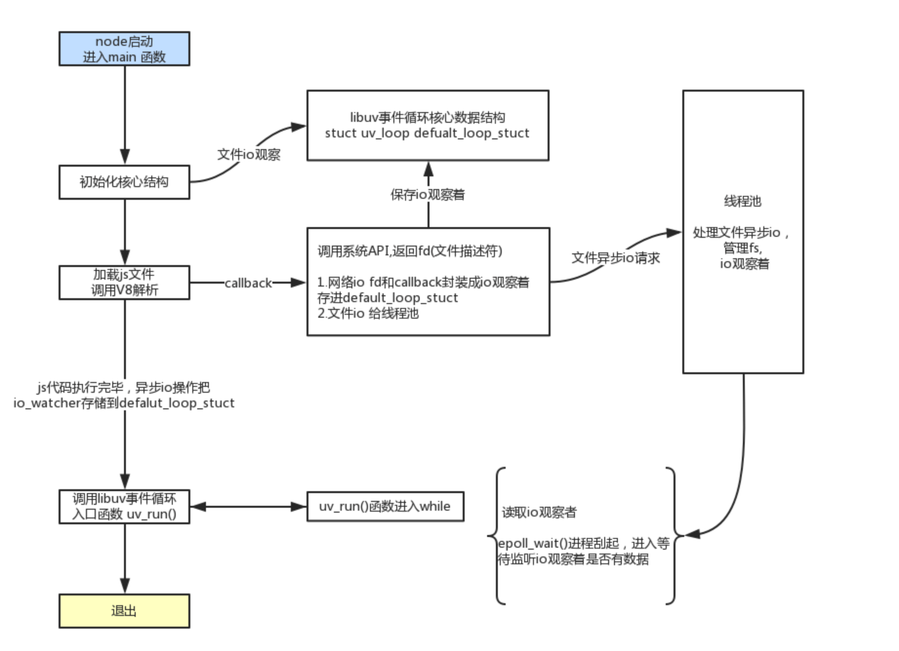

Node.js 是一个基于 Chrome V8 JavaScript 引擎的 JavaScript 运行时环境。它允许开发者在服务器端运行 JavaScript 代码，从而使用同一种语言编写前端和后端代码。Node.js 的非阻塞 I/O 和事件驱动架构使其非常适合构建高性能、可扩展的网络应用。

### 一、Node.js 特点和应用场景
## 1、特点
# （1）非阻塞 I/O：
 - Node.js 使用事件驱动、非阻塞 I/O 模型，使其非常适合处理高并发请求。
 - Node.js的很多 I/O 操作（如网络请求）是非阻塞的，这意味着I/O操作不会阻塞主线程。相反，I/O 操作会被异步执行，当操作完成时，相关的回调函数会被放入事件队列中等待执行。这种模型不会阻塞其他操作，提示性能和响应速度。

# （2）事件驱动架构：
 - Node.js 的核心是一个事件循环，通过事件和回调机制来处理异步操作。
 - 这种架构使得 Node.js 可以高效地处理大量并发连接，而不会因为等待 I/O 操作而阻塞。

# （3）单线程：
 - Node.js 运行在单个线程中，但通过事件循环和异步 I/O 操作，可以有效地管理多个并发连接。
 - 这种设计简化了开发过程，因为开发者不需要担心线程同步问题。传统的多线程模型是通过为每个请求创建一个新的线程来实现并发处理的。

# （4）跨平台：
 - Node.js 可以在多个操作系统上运行，包括 Windows、Linux 和 macOS。
 - 这种跨平台的特性使得开发者可以在不同环境中轻松部署和运行 Node.js 应用。

# （5）丰富的生态系统：
 - Node.js 拥有一个庞大的包管理器（npm），提供了丰富的第三方模块和库，简化了开发过程。
 - 开发者可以通过 npm 轻松安装和管理依赖项，快速构建功能强大的应用。

## 2、Node.js 的应用场景

# （1）Web 应用：
 - Node.js 非常适合构建高性能的 Web 应用，如实时聊天应用、社交网络、内容管理系统等。
 - 通过 Express.js 等框架，可以快速构建和部署 Web 应用。

# （2）API 服务：
 - Node.js 可以用来构建 RESTful API 和 GraphQL API，提供高效的数据接口。
 - 由于其非阻塞 I/O 特性，Node.js 可以高效处理大量并发请求，非常适合构建 API 服务。

# （3）实时应用：
 - Node.js 非常适合构建实时应用，如在线游戏、实时协作工具、实时数据分析等。
 - 通过 WebSocket 等技术，可以实现低延迟的实时通信。

# （4）微服务架构：
 - Node.js 可以用于构建微服务架构，通过拆分单一应用为多个独立的服务，提高系统的可扩展性和可维护性。
 - 通过 Docker 等容器技术，可以轻松部署和管理 Node.js 微服务。

## 结论
Node.js 是一个强大的 JavaScript 运行时环境，通过非阻塞 I/O 和事件驱动架构，提供了高性能和高并发处理能力。它的丰富生态系统和跨平台特性，使得开发者可以轻松构建和部署各种类型的应用，包括 Web 应用、API 服务、实时应用和微服务架构。Node.js 的出现，使得 JavaScript 不再局限于前端开发，成为全栈开发的重要工具。

### 二、Node.js原理
上面提到了 Node.js 的特点，下面会这些特点进行详细的分析和说明。

## 1、Node.js 如何与操作系统打交道的？
# （1）Node.js 底层结构
首先，介绍一下 Node.js 的架构图： 

 

1. JavaScript V8 Engine: Nodejs JavaScript 运行引擎；
2. Libuv 是专门为 Node.js 开发的一个封装库，提供跨平台的异步 I/O 能力；
3. C-ares：提供了异步处理 DNS 相关的能力；
4. http_parser、OpenSSL、zlib 等：提供包括 http 解析、SSL、数据压缩等其他的能力。

从 JavaScript 调用 Node.js 的核心模块，核心模块调用 C++ 内建模块，内建模块通过`libuv`进行系统调用，这是 Node.js 里经典的调用方式。


`libuv`是一个多平台支持库，主要用于处理异步 I/O 操作。它为 Node.js 提供了事件循环、文件系统操作、网络操作以及子进程管理等功能。比如：
```js
const fs = require('fs');

fs.readFile('example.txt', 'utf8', (err, data) => {
  if (err) {
    console.error('Error reading file:', err);
    return;
  }
  console.log('File content:', data);
});
```
在这个示例中，`fs.readFile`实际上调用了`libuv`的文件读取 API ，这个操作是在后台线程池中执行的。当文件读取完成后，`libuv`会通过回调函数将结果返回给主线程。总的来说，`libuv`是 Node.js 与操作系统交互的桥梁，提供了一套跨平台的异步 I/O API，使得 Node.js 能够高效地处理各种 I/O 操作。

# （2）libuv的作用
`libuv`是一个跨平台的异步 I/O 库，Node.js 使用它来处理底层的 I/O 操作。`libuv`主要提供以下功能：

1. 事件循环：`libuv`实现了 Node.js 的事件循环机制；
2. 异步 I/O 操作：`libuv`提供了一套跨平台的 API，用于处理文件系统操作、网络操作等；
3. 线程池：`libuv`使用一个线程池来执行一些无法通过事件循环高效处理的操作，如文件系统操作和 DNS 解析；
4. 子进程管理：`libuv`提供了创建和管理子进程的功能。

## 2、Node.js单线程如何实现异步、非阻塞I/O？
假设我们现在拿到一组任务，其中既有 I/O 又有 CPU 计算，同时假设我们的计算机是多核的但计算机资源有限的，为了减少上述的资源浪费情况你会怎么做？ 

*（1）第一种方案：多线程* 

通过创建多个线程来分别执行 CPU 计算和 I/O ，这样 CPU 计算不会被 I/O 阻塞了。它有如下的缺点：
1. 硬件上：创建线程和线程上下文切换有时间开销;
2. 软件上：多线程编程模型的死锁、状态同步等问题让开发者头疼。

*（2）第二种方案：单线程 + 异步I/O*

它可以规避上述方案的缺点。通过事件驱动的方式，当单线程执行 CPU 计算， I/O 通过异步来进行调用和返回结果。这样也能使 I/O 不阻塞 CPU 计算。但是它也有缺点：
1. 单线程没法利用多核 CPU 的优点。（一个线程肯定没法运行在多个 CPU 上）；
2. 线程一崩，整个程序就崩溃了。（多线程这个问题的影响很小）；
3. 非阻塞 I/O 通过轮询实现的，轮询会消耗额外的CPU资源。

这里需要说明一下，非阻塞 I/O 本身并不需要专门的线程来执行，这是它的一个关键特点。非阻塞 I/O 的核心思想是， I/O 操作可以立即返回，并且不会阻塞执行流，等待操作完成时通过*事件或回调机制*通知应用程序。以下是关于非阻塞 I/O 的一些详细解释：

**非阻塞I/O的工作原理**

1. 发起 I/O 操作：当应用程序发起一个非阻塞 I/O 操作（例如读取网络数据），操作系统会立即返回，而不会等待操作完成。这个操作在用户空间的主线程中发起；
2. 内核处理：操作系统内核负责实际的 I/O 操作。内核会将 I/O 请求放入相应的 I/O 队列中，并在后台处理这些请求。内核使用中断或其他机制来处理 I/O 操作的完成；
3. 事件通知：当I/O操作完成或有数据可读时，操作系统内核会通过事件通知机制（如epoll、kqueue、IOCP等）通知应用程序。应用程序的事件循环会监听这些事件，并在事件发生时执行相应的回调函数。

Node.js 实际上与上面两种方案都不同。 首先，Node.js 被称为单线程的原因是它的*主线程*是单线程的，这意味着`JavaScript`代码在 Node.js 中是运行在一个单独的线程上的。 Node.js 能够高效处理大量并发的 I/O 操作，这主要归功于其事件驱动的架构和`libuv`库的支持。下面详细解释 Node.js 是如何实现异步 I/O 操作的。

# Node.js异步I/O机制详解

1. 非阻塞 I/O: 对于大多数网络 I/O 操作（如HTTP请求、TCP连接等），Node.js 使用操作系统提供的非阻塞 I/O 接口。这些接口允许在不阻塞主线程的情况下发起 I/O 操作，并在操作完成时通过事件通知主线程。这种方式不需要为每个 I/O 操作创建一个独立的线程。
2. 事件循环: Node.js 的事件循环是处理异步 I/O 操作的核心机制。事件循环会不断检查是否有 I/O 操作完成，如果有，则执行相应的回调函数。事件循环使得Node.js能够高效地处理大量并发的 I/O 操作，而不需要为每个操作创建一个线程。
3. 线程池: 对于一些无法通过非阻塞 I/O 接口高效处理的操作（如文件系统操作和DNS解析），Node.js 使用`libuv`的线程池来执行这些操作。线程池中的线程可以并行执行任务，但这并不意味着每个 I/O 操作都会创建一个独立的线程。

总结来说，异步I/O的流程大致如下： 

 

Node.js 会首先判断是非阻塞 I/O 还是阻塞 I/O，对于非阻塞 I/O（如网络I/O） 会封装成io观察者直接进入`default_loop_stuct`事件循环；对于阻塞 I/O（如文件I/O） 则会给线程池。最后都是通过调用`libuv`事件循环中监听 I/O 完成事件。

还有，值得注意的是， Node.js 还提供了`cluster`模块和`child_process`模块，帮助开发者通过 JavaScript 显式使用和管理多进程。所以，Node.js 适用于I/O密集型，而不适用于 CPU 密集型（如复杂的计算、图像处理、加密解密等）这种言论是考虑到 CPU 密集型任务会占用大量的CPU时间，阻塞事件循环，导致其他异步操作无法及时处理。但是，Node.js 是可以通过创建多进程来缓解这种问题的。比如：

主进程代码: 首先，我们创建一个主进程，用于管理和调度子进程
```js
// master.js
const { fork } = require('child_process');
const numCPUs = require('os').cpus().length;

console.log(`Master ${process.pid} is running`); // 主进程process.pid，每一个进程都有一个pid

// 创建多个子进程
for (let i = 0; i < numCPUs; i++) {
  const worker = fork('./worker.js'); // 创建子进程worker

  // 监听worker进程并获取计算结果
  worker.on('message', (message) => {
    console.log(`Worker ${worker.pid} finished task with result: ${message}`);
  });

  // 每个子进程发一个计算fibonacci的事件
  worker.send({ task: 'fibonacci', number: 40 });
}

process.on('exit', () => {
  console.log('Master process exiting');
});
```

子进程代码：创建一个子进程，用于执行CPU密集型任务（计算斐波那契数列）。
```js
// worker.js
// worker进程计算完成后发送结果
process.on('message', (message) => {
  if (message.task === 'fibonacci') {
    const result = fibonacci(message.number);
    process.send(result);
  }
});

function fibonacci(n) {
  if (n <= 1) return n;
  return fibonacci(n - 1) + fibonacci(n - 2);
}

process.on('exit', () => {
  console.log(`Worker ${process.pid} exiting`);
});
/**
 * 备注：
 * 1. worker.send：发送事件；
 * 2. process.on：监听当前进程事件；
 * 3. worker.on：监听子进程或Worker进程的事件。
 */
```

运行后，你会看到类似以下的输出，表示主进程和子进程正在协同工作： 
```js
Master 12345 is running
Worker 12346 finished task with result: 102334155
Worker 12347 finished task with result: 102334155
Worker 12348 finished task with result: 102334155
Worker 12349 finished task with result: 102334155
```

Node.js 本身不会自动创建多个进程处理 CPU 密集型任务，需要开发者主动创建和管理多进程。

### 三、Node.js内置模块
Node.js 提供了一系列内置模块，这些模块涵盖了文件系统操作、网络通信、数据处理等多种功能，帮助开发者快速构建高效的服务器端应用(详情：https://nodejs.cn/api/)。以下是一些常用的内置模块：

## 1、文件系统模块 (fs)
- 功能：用于文件系统操作，如读取、写入、删除文件和目录等。
- 示例： 

```js
const fs = require('fs');

// 读取文件
fs.readFile('example.txt', 'utf8', (err, data) => {
  if (err) throw err;
  console.log(data);
});

// 写入文件
fs.writeFile('example.txt', 'Hello, Node.js!', (err) => {
  if (err) throw err;
  console.log('File has been saved!');
});
```
## 2、HTTP 模块 (http)
- 功能：用于创建 HTTP 服务器和客户端，处理 HTTP 请求和响应。
nodejs创建http服务器方法。示例：  
# （1）创建一个GET服务
```js
const http = require('http'); // 引入 Node.js 内置的 http 模块

const hostname = '127.0.0.1'; // 定义服务器的主机名
const port = 3000; // 定义服务器的端口号

// 创建一个 HTTP 服务器（默认GET，如果需要参数则通过 URL 的查询字符串传递）
const server = http.createServer((req, res) => {
    res.statusCode = 200; // 设置响应状态码为 200（表示成功）
    res.writeHead(200, { 'Content-Type': 'text/plain' }); // 设置响应头，指定内容类型为纯文本
    // res.setHeader('Content-Type', 'text/plain'); // 也可以用setHeader设置响应头
    /** 
     * 当标头已使用 outgoingMessage.setHeaders() 设置时，则它们将与任何传给 response.writeHead() 的标头合并，其中传给response.writeHead() 的标头优先。res.writeHead 可以一次性设置多个响应头，res.setHeader 每次只能设置一个响应头。
     */
    res.end('Hello World\n'); // 结束响应并发送响应内容
});

// 服务器开始监听指定的主机名和端口
server.listen(port, hostname, () => {
    console.log(`Server running at http://${hostname}:${port}/`); // 打印服务器运行信息
});
```
# （2）创建一个POST请求
```js
const http = require('http');

const server = http.createServer((req, res) => {
    if (req.method === 'POST') {
        let body = '';

        // 监听数据传输事件（监听的req数据，因为post请求req比较大，可能会分包传输）
        req.on('data', chunk => {
            body += chunk.toString(); // 将二进制数据转换为字符串并追加到 body
        });

        // 监听数据传输结束事件
        req.on('end', () => {
            console.log('Received body:', body);

            // 解析 JSON 数据
            let parsedData;
            try {
                parsedData = JSON.parse(body);
            } catch (e) {
                res.writeHead(400, { 'Content-Type': 'text/plain' }); // 浏览器或客户端会将响应内容当作普通文本处理
                res.end('Invalid JSON');
                return;
            }

            // 处理解析后的数据
            console.log('Parsed data:', parsedData);

            // 发送响应
            res.writeHead(200, { 'Content-Type': 'application/json' }); // 响应内容是 JSON 格式
            res.end(JSON.stringify({ message: 'Data received', data: parsedData }));
        });
    } else {
        // 处理其他请求方法
        res.writeHead(405, { 'Content-Type': 'text/plain' });
        res.end('Method Not Allowed');
    }
});

server.listen(3000, '127.0.0.1', () => {
    console.log('Server running at http://127.0.0.1:3000/');
});
```
# （3）调用服务
上面仅仅是创建了服务器，调用服务的方式如下。服务端通过使用`axios`，Axios 是一个基于 promise 的网络请求库，可以用于浏览器和 node.js，使得发送请求和处理响应变得非常简单（axios官网：https://www.axios-http.cn/，axios就是提供了几个网络相关的api）； `web`端则通常使用`fetch`方法。

**1. 服务端调用**
```js
const axios = require('axios');

async function sendPostRequest() {
    try {
        const response = await axios.post('http://127.0.0.1:3000/', {
            name: 'John',
            age: 30
        }, {
            headers: {
                'Content-Type': 'application/json' // 返回json格式
            }
        });

        console.log('Response data:', response.data);
    } catch (error) {
        console.error('Error making POST request:', error);
    }
}

sendPostRequest();

/**
 * 备注：“服务创建”和“服务请求”的时候，应该设置适当的 HTTP 头（headers），如要返回 JSON 数据，你需要设置 Content-Type 为 application/json。
 * 常用http标头：
 * （1）请求头（Request Headers）
 * 1. Content-Type：指定请求体的媒体类型（MIME 类型）。示例：Content-Type: application/json
 * 2. Authorization：包含认证信息。示例：Authorization: Bearer your-token
 * 3. User-Agent：标识客户端应用程序。示例：User-Agent: Mozilla/5.0 (Windows NT 10.0; Win64; x64)
 * （2）响应头（Response Headers）
 * 1. Content-Type：指定响应体的媒体类型（MIME 类型）。示例：Content-Type: application/json
 * 2. Set-Cookie：设置 cookie。示例：Set-Cookie: sessionId=abc123; Path=/; HttpOnly，详情见cookie.md
 * 3. Cache-Control：指示缓存机制。示例：Cache-Control: no-cache
 * （常用http标头：https://developer.mozilla.org/zh-CN/docs/Web/HTTP/Headers，http相关知识，这里不做细说）
 */
```

**2. web端调用**
```html
<!DOCTYPE html>
<html lang="en">
<head>
    <meta charset="UTF-8">
    <meta name="viewport" content="width=device-width, initial-scale=1.0">
    <title>POST Request Example</title>
</head>
<body>
    <button id="sendRequest">Send POST Request</button>
    <script>
        document.getElementById('sendRequest').addEventListener('click', async () => {
            try {
                const response = await fetch('http://127.0.0.1:3000/', {
                    method: 'POST',
                    headers: {
                        'Content-Type': 'application/json'
                    },
                    body: JSON.stringify({
                        name: 'John',
                        age: 30
                    })
                });

                const data = await response.json();
                console.log('Response data:', data);
            } catch (error) {
                console.error('Error making POST request:', error);
            }
        });
    </script>
</body>
</html>
```
**3. 自定义服务请求方法**
当然，也可以使用`node.js`自带的模块，自定义服务请求方法。但是，`axios`和`fetch`有自动处理 JSON 的功能。`axios`还提供了请求和响应拦截器，可以在请求发送前或响应接收后执行一些操作，例如添加认证令牌或处理全局错误；以及`axios`支持取消请求，这在处理用户输入时非常有用，例如搜索框的自动补全功能等等。所以，自己封装请求方法要考虑需要功能。
```js
// GET 请求
const http = require('http');
const https = require('https');

function httpGet(url) {
    return new Promise((resolve, reject) => {
        const client = url.startsWith('https') ? https : http;
        client.get(url, (response) => {
            let data = '';

            // 监听数据传输事件（response可能比较大，需要分包）
            response.on('data', (chunk) => {
                data += chunk;
            });

            // 监听数据传输结束事件
            response.on('end', () => {
                resolve(data);
            });

        }).on('error', (error) => {
            reject(error);
        });
    });
}

// 使用示例
httpGet('http://www.example.com')
    .then(data => console.log(data))
    .catch(error => console.error(error));
```

```js
// POST请求
const http = require('http');
const https = require('https');

function httpPost(url, data, headers = {'Content-Type': 'application/json'}) {
    return new Promise((resolve, reject) => {
        const client = url.startsWith('https') ? https : http;
        const options = {
            method: 'POST',
            headers: headers
        };

        const req = client.request(url, options, (response) => {
            let responseData = '';

            // 监听数据传输事件（response比较大，可能会分包）
            response.on('data', (chunk) => {
                responseData += chunk;
            });

            // 监听数据传输结束事件
            response.on('end', () => {
                resolve(responseData);
            });
        });

        req.on('error', (error) => {
            reject(error);
        });

        // Write data to request body
        req.write(JSON.stringify(data));
        req.end();
    });
}

// 使用示例
httpPost('http://www.example.com', {name: 'John', age: 30})
    .then(data => console.log(data))
    .catch(error => console.error(error));
```

## 3、 路径模块 (path)
- 功能：用于处理和转换文件路径。
- 示例： 

```js
const path = require('path');

// 获取文件名
console.log(path.basename('/foo/bar/baz/asdf/quux.html')); // 输出: 'quux.html'

// 获取目录名
console.log(path.dirname('/foo/bar/baz/asdf/quux.html')); // 输出: '/foo/bar/baz/asdf'

// 解析路径
console.log(path.parse('/foo/bar/baz/asdf/quux.html'));
```

## 4、 URL 模块 (url)
- 功能：用于解析和格式化 URL。
- 示例：
```js
const url = require('url');

const myURL = new URL('https://example.org:8080/foo/bar?name=abc#hash');
console.log(myURL.hostname); // 输出: 'example.org'
console.log(myURL.pathname); // 输出: '/foo/bar'
console.log(myURL.searchParams.get('name')); // 输出: 'abc'
```

## 5、 事件模块 (events)
- 功能：提供事件驱动编程的支持，可以创建和处理自定义事件。
- 示例：
```js
const EventEmitter = require('events');

class MyEmitter extends EventEmitter {}

const myEmitter = new MyEmitter();

// 监听事件
myEmitter.on('event', () => {
  console.log('An event occurred!');
});

// 触发事件
myEmitter.emit('event');
```

## 6、 流模块 (stream)
- 功能：Node.js 的流（Stream）是处理数据的一种高效方式，特别适用于处理大量数据或需要逐步处理的数据。上面的`http`请求就是流对象。举个简单的例子，所谓流媒体就是视频或音频流媒体可以边传输边播放。 
# （1）网络传输
```js
const http = require('http');

const server = http.createServer((req, res) => {
  let data = '';
  // 这里就可以直接处理chunk，而不用等到数据传输结束
  req.on('data', (chunk) => {
    data += chunk;
  });

  req.on('end', () => {
    console.log('Complete data received:', data);
    res.end('Data received');
  });
});

server.listen(3000, () => {
  console.log('Server is listening on port 3000');
});
```
除了网络传输，流的应用非常广泛，比如：
# （2）大文件读写
```js
const fs = require('fs');

const readableStream = fs.createReadStream('largeFile.txt'); // 要读取的文件名：largeFile.txt
const writableStream = fs.createWriteStream('outputFile.txt'); // 要写入的文件名：outputFile.txt

// 写大文件
writableStream.write('First line\n'); // 写入内容：First line\n, Second line\n, End of file\n
writableStream.write('Second line\n');
writableStream.end('End of file\n');

// 读取大文件
readableStream.on('data', (chunk) => {
  console.log('Received chunk:', chunk.toString());
});
readableStream.on('end', () => {
  console.log('File reading completed');
});
```

# （3）TCP 套接字
使用流来处理 TCP 套接字的数据，可以逐步接收和发送数据。
```js
const net = require('net');

const server = net.createServer((socket) => {
  socket.on('data', (chunk) => {
    console.log('Received chunk:', chunk.toString());
  });

  socket.on('end', () => {
    console.log('Connection ended');
  });

  socket.write('Hello, client!\n');
});

server.listen(3000, () => {
  console.log('Server is listening on port 3000');
});
```

# （4）数据压缩和解压
```js
const fs = require('fs');
const zlib = require('zlib');
// 压缩文件
const readableStream = fs.createReadStream('input.txt');
const writableStream = fs.createWriteStream('input.txt.gz');
const gzip = zlib.createGzip(); // 创建一个 Gzip 压缩流
readableStream.pipe(gzip).pipe(writableStream);

// 解压缩文件
const compressedInput = fs.createReadStream('inputFile.txt.gz');
const decompressedOutput = fs.createWriteStream('outputFile.txt');
const gunzip = zlib.createGunzip(); // 创建一个 Gzip 解压缩流
compressedInput.pipe(gunzip).pipe(decompressedOutput);
```

# （5）媒体流处理
下面代码创建了一个 HTTP 服务器，并以流的形式输出 video.mp4 文件。当客户端请求该服务器时，服务器会将 video.mp4 文件以流的方式发送给客户端。
```js
const fs = require('fs');
const http = require('http');

http.createServer((req, res) => {
  const readableStream = fs.createReadStream('video.mp4');
  res.writeHead(200, { 'Content-Type': 'video/mp4' });
  readableStream.pipe(res);
}).listen(3000, () => {
  console.log('Server is listening on port 3000');
});
```

## 7、 buffer模块
- 功能：Buffer 对象用于表示固定长度的字节序列，buffer模块用于处理二进制数据。别被名字误导。  

首先，之所以要处理二进制数据，是因为二进制数据处理可以确保高效性、数据完整性、性能优化以及对特殊数据格式的支持。如下： 

1. 文件操作：许多文件格式（如图片、音频、视频、压缩文件等）都以二进制形式存储。使用二进制数据可以高效地读取、写入和处理这些文件。
2. 网络通信：网络协议（如 TCP、HTTP 等）通常以二进制形式传输数据。处理二进制数据可以确保数据传输的高效性和准确性。
  - TCP/IP：底层网络协议使用二进制数据包进行通信。
  - HTTP：虽然 HTTP 请求和响应的主体可以是文本，但头部和某些主体内容（如文件上传）需要以二进制形式处理。
3. 数据库操作：某些数据库（如 MongoDB、Cassandra 等）支持二进制数据存储。处理二进制数据可以更高效地进行数据存储和检索。
4. 性能和效率：二进制数据通常比文本数据更紧凑，处理二进制数据可以提高性能和效率。
  - 紧凑性：二进制数据不需要编码转换，通常比文本数据更紧凑，占用更少的存储空间和带宽。
  - 高效处理：处理二进制数据通常比处理文本数据更高效，因为不需要进行编码和解码操作。
5. 数据完整性：在某些情况下，使用二进制数据可以确保数据的完整性和准确性。
  - 精度：某些数据类型（如浮点数、整数等）在二进制形式下可以保持更高的精度，而在文本形式下可能会丢失精度。
  - 无损传输：二进制数据可以确保在传输过程中不丢失信息，而文本数据可能会因为编码问题导致信息丢失。
6. 特殊数据处理：某些应用场景需要处理特殊的数据格式，这些数据格式通常以二进制形式存在。
  - 加密数据：加密算法通常会生成二进制数据，需要以二进制形式进行处理。
  - 压缩数据：压缩算法生成的压缩文件通常是二进制文件，需要以二进制形式进行处理。

因此，Node.js 提供了 Buffer 类来专门处理二进制数据，以满足这些需求。下面举个简单的 Buffer 处理二进制的例子：
```js
const { Buffer } = require('node:buffer'); // 虽然 Buffer 类在全局作用域内可用，但仍然建议通过 import 或 require 语句显式地引用它。
const buf = Buffer.from('Hello, World!', 'utf8'); // 把'Hello, World!'（指定了字符串是以 UTF-8 编码的）转为Buffer对象

// buf.toString('hex')将 Buffer 转换回对应的编码的字符串
console.log(buf.toString('hex')); // 输出: '48656c6c6f2c20576f726c6421'
console.log(buf.toString('base64')); // 输出: 'SGVsbG8sIFdvcmxkIQ=='
```

## 8、 加密模块 (crypto)
- 功能：`node:crypto` 模块提供了加密功能，其中包括了用于 OpenSSL 散列、HMAC、加密、解密、签名、以及验证的函数的一整套封装。
- 示例： 

```js
const crypto = require('crypto');

// 生成哈希
const hash = crypto.createHash('sha256').update('Hello, World!').digest('hex');
console.log(hash); // 输出: 哈希值
```
需要注意的是，要先确定加密模块是否可用，否则mport crypto 或调用 require('node:crypto') 将导致抛出错误。如下： 

```js
let crypto;
try {
  crypto = require('node:crypto');
} catch (err) {
  console.error('crypto support is disabled!');
} 
```

## 9、 操作系统模块 (os)
- 功能：提供与操作系统相关的信息和功能，如获取系统内存、CPU 信息等。
- 示例：
```js
const os = require('os');

console.log(os.platform()); // 输出: 操作系统平台
console.log(os.cpus()); // 输出: CPU 信息
console.log(os.totalmem()); // 输出: 总内存
```

## 10、 子进程模块 (child_process)
- 功能：用于创建和控制子进程，执行系统命令。`node:child_process` 模块提供了以与 `popen(3)` 类似但不相同的方式生成子进程的能力。此功能主要由 `child_process.spawn()` 函数提供：
```js
// 功能：使用 Node.js 的 child_process 模块中的 spawn() 方法来创建一个子进程，执行 ls -lh /usr 命令，并处理其输出和错误信息。
const { spawn } = require('node:child_process');
// 创建了一个子进程来执行 ls -lh /usr 命令
const ls = spawn('ls', ['-lh', '/usr']);

// 监听子进程的标准输出（stdout）数据事件
ls.stdout.on('data', (data) => {
  console.log(`stdout: ${data}`);
});

// 监听子进程的标准错误输出（stderr）数据事件
ls.stderr.on('data', (data) => {
  console.error(`stderr: ${data}`);
});

// 监听子进程的关闭事件（close）
ls.on('close', (code) => {
  console.log(`child process exited with code ${code}`);
});
```
`child_process.spawn()` 方法异步衍生子进程，不会阻塞 Node.js 事件循环。`child_process.spawnSync()` 函数以同步方式提供等效的功能，其会阻塞事件循环，直到衍生的进程退出或终止。为方便起见，`node:child_process` 模块提供了一些同步和异步方法替代 `child_process.spawn()` 和 `child_process.spawnSync()`。这些替代方法中的每一个都是基于 `child_process.spawn()` 或 `child_process.spawnSync()` 实现，如下：
1. child_process.exec()：衍生 shell 并在该 shell 中运行命令，完成后将 stdout 和 stderr 传给回调函数（child_process.exec() 设计为通过 Shell 来执行命令，以便支持复杂的 Shell 语法和操作。例如，管道、重定向和环境变量设置等操作都需要通过 Shell 来解释和执行）。

2. child_process.execFile()：与 child_process.exec() 类似，不同之处在于，默认情况下，它直接衍生命令，而不先衍生 shell。

3. child_process.fork()：衍生新的 Node.js 进程并使用建立的 IPC 通信通道（其允许在父子进程之间发送消息）调用指定的模块。

4. child_process.execSync()：child_process.exec() 的同步版本，其将阻塞 Node.js 事件循环。

5. child_process.execFileSync()：child_process.execFile() 的同步版本，其将阻塞 Node.js 事件循环。 

具体用法看官方文档。

## 11、DNS模块
使用它来查找主机名的 IP 地址。虽然以 域名系统 (DNS) 命名，但它并不总是使用 DNS 协议进行查找。`dns.lookup()` 使用操作系统工具来执行名称解析。它可能不需要执行任何网络通信。`dns.resolve()` 则是直接通过 DNS 协议进行查找，需要直接与 DNS 服务器通信。
```js
const dns = require('node:dns');

// dns.lookup(hostname[, options], callback)
dns.lookup('example.org', (err, address, family) => {
  console.log('address: %j family: IPv%s', address, family);
});

// dns.resolve(hostname[, rrtype], callback)
dns.resolve('example.org', 'A', (err, addresses) => {
  if (err) {
    console.error('Error:', err);
  } else {
    console.log('addresses: %j', addresses);
  }
});
/** 总结
 * 1. dns.lookup()：使用操作系统的 DNS 解析机制，依赖于操作系统的 DNS 配置。适用于大多数常见的 DNS 解析需求。
 * 2. dns.resolve()：直接通过 DNS 协议进行查找，绕过操作系统的缓存和本地配置。适用于需要进行特定类型的 DNS 查询（如 MX、TXT 记录）或需要指定 DNS 服务器的场景。
 */
```

## 12、async_hooks异步钩子
其中的`AsyncLocalStorage`是`nodejs`常用的异步操作共享数据的方法。每个实例维护一个独立的存储上下文，多个实例可以安全地同时存在，而不会有干扰彼此数据的风险。示例：
```js
// require('node:http') 是一种新的模块导入方式，用于明确指定模块的来源。这种方式在 Node.js 14.13.1 及更高版本中引入，目的是增强模块导入的清晰度和可读性。
const http = require('node:http');
const { AsyncLocalStorage } = require('node:async_hooks');

const asyncLocalStorage = new AsyncLocalStorage();

function logWithId(msg) {
  const id = asyncLocalStorage.getStore();
  console.log(`${id !== undefined ? id : '-'}:`, msg);
}

let idSeq = 0;
http.createServer((req, res) => {
  asyncLocalStorage.run(idSeq++, () => {
    logWithId('start');
    // 异步操作
    setImmediate(() => {
      logWithId('finish');
      res.end();
    });
  });
}).listen(8080);

http.get('http://localhost:8080');
http.get('http://localhost:8080');
// Prints:
//   0: start
//   1: start
//   0: finish
//   1: finish
```

### 四、阻塞&非阻塞
Node.js 标准库中所有的 I/O 方法都提供异步版本，非阻塞，接受回调函数。 一些方法也有对应的 阻塞，其名称以 Sync 结尾。我们理所当然优先使用非阻塞方法，阻塞方法一般仅仅在工具调试或者简单的程序中使用，比如：
```js
// 阻塞
const fs = require('fs');

// 使用阻塞方法读取文件
const data = fs.readFileSync('/path/to/file.txt', 'utf8');
console.log(data);

// 使用阻塞方法写入文件
fs.writeFileSync('/path/to/another-file.txt', data);
```
上述代码就是举一个简单的例子，说明下一个任务依赖上一个结果的时候，要注意代码的执行顺序。但是实际上，真正在项目中，我们不会怎么写，既然依赖，就应该使用“回调函数”或者 `async/await` 来控制代码的执行顺序。应该如下：

**回调函数** 
```js
const fs = require('fs');

// 使用非阻塞方法读取文件
fs.readFile('/path/to/file.txt', 'utf8', (err, data) => {
    if (err) {
        return console.error(err);
    }
    console.log(data);

    // 使用非阻塞方法写入文件
    fs.writeFile('/path/to/another-file.txt', data, (err) => {
        if (err) {
            return console.error(err);
        }
        console.log('File written successfully');
    });
});
```

**async/await方式**
```js
const fs = require('fs').promises;

async function readAndWriteFiles() {
    try {
        // 使用非阻塞方法读取文件
        const data = await fs.readFile('/path/to/file.txt', 'utf8');
        console.log(data);

        // 使用非阻塞方法写入文件
        await fs.writeFile('/path/to/another-file.txt', data);
        console.log('File written successfully');
    } catch (err) {
        console.error(err);
    }
}

readAndWriteFiles();
```
`async/await` 使异步代码看起来像同步代码，极大地提高了代码的可读性和可维护性。并且使用 `try/catch` 语句来处理错误，直观和简洁。“回调函数”如果嵌套过多会导致代码难以阅读和维护，这种现象被称为“回调地狱”，。不过`async/await`需要 ES2017 支持，所以 nodejs 中版本要注意使用新版或者编译器要包含必要的库，如下：
```js
// tsconfig.json文件
{
  "compilerOptions": {
    "target": "es6", // javascript版本
    "module": "commonjs", // 模块系统
    "lib": ["ES2021"], // 要包含ES2021库
    "outDir": "./dist",
    "rootDir": "./src",
    "strict": true,
    "esModuleInterop": true,
    "skipLibCheck": true,
    "forceConsistentCasingInFileNames": true
  },
  "include": ["src/**/*"],
  "exclude": ["node_modules", "**/*.spec.ts"]
}
```

当然，即使项目中版本低于ES2017，也可以使用编译器如 Babel 进行转化，具体见tsconfig和babel等工具。


### 五、参考文献
1. [nodejs单线程？非阻塞I/O？异步?](https://blog.csdn.net/weixin_45277161/article/details/117331334)
2. [libuv之 - 只看这篇是不够的](https://juejin.cn/post/6945702722645524517#heading-7)
3. [一步步分析 Node.js 的异步I/O机制](https://juejin.cn/post/6844903859094028301)
4. [nodejs源码分析](https://github.com/fzxa/NodeJS-Nucleus-Plus-Internals)
5. [nodejs官网教程](https://dev.nodejs.cn/learn/)
