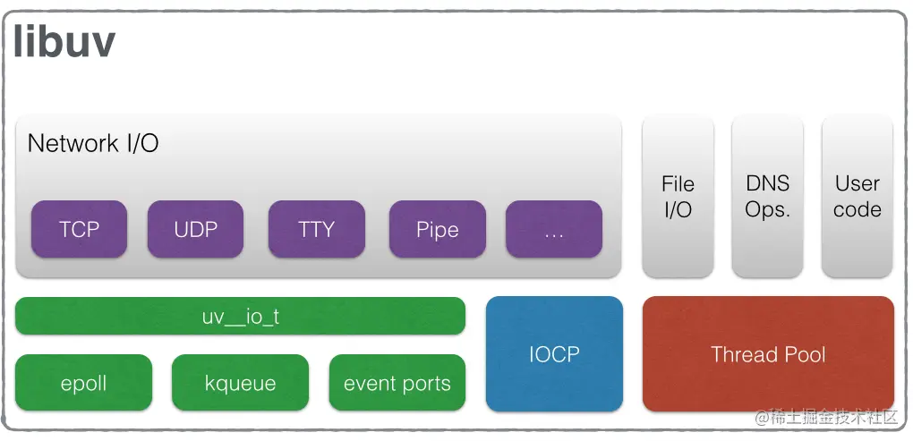

Node.js 是一个基于 Chrome V8 JavaScript 引擎的 JavaScript 运行时环境。它允许开发者在服务器端运行 JavaScript 代码，从而使用同一种语言编写前端和后端代码。Node.js 的非阻塞 I/O 和事件驱动架构使其非常适合构建高性能、可扩展的网络应用。

### 一、Node.js 特点和应用场景
## 1、特点
# （1）非阻塞 I/O：
 - Node.js 使用事件驱动、非阻塞 I/O 模型，使其非常适合处理高并发请求。
 - Node.js的很多 I/O 操作（如网络请求）是非阻塞的，这意味着I/O操作不会阻塞主线程。相反，I/O 操作会被异步执行，当操作完成时，相关的回调函数会被放入事件队列中等待执行。这种模型不会阻塞其他操作，提示性能和响应速度。

# （2）事件驱动架构：
 - Node.js 的核心是一个事件循环，通过事件和回调机制来处理异步操作。
 - 这种架构使得 Node.js 可以高效地处理大量并发连接，而不会因为等待 I/O 操作而阻塞。

# （3）单线程：
 - Node.js 运行在单个线程中，但通过事件循环和异步 I/O 操作，可以有效地管理多个并发连接。
 - 这种设计简化了开发过程，因为开发者不需要担心线程同步问题。传统的多线程模型是通过为每个请求创建一个新的线程来实现并发处理的。

# （4）跨平台：
 - Node.js 可以在多个操作系统上运行，包括 Windows、Linux 和 macOS。
 - 这种跨平台的特性使得开发者可以在不同环境中轻松部署和运行 Node.js 应用。

# （5）丰富的生态系统：
 - Node.js 拥有一个庞大的包管理器（npm），提供了丰富的第三方模块和库，简化了开发过程。
 - 开发者可以通过 npm 轻松安装和管理依赖项，快速构建功能强大的应用。

## 2、Node.js 的应用场景

# （1）Web 应用：
 - Node.js 非常适合构建高性能的 Web 应用，如实时聊天应用、社交网络、内容管理系统等。
 - 通过 Express.js 等框架，可以快速构建和部署 Web 应用。

# （2）API 服务：
 - Node.js 可以用来构建 RESTful API 和 GraphQL API，提供高效的数据接口。
 - 由于其非阻塞 I/O 特性，Node.js 可以高效处理大量并发请求，非常适合构建 API 服务。

# （3）实时应用：
 - Node.js 非常适合构建实时应用，如在线游戏、实时协作工具、实时数据分析等。
 - 通过 WebSocket 等技术，可以实现低延迟的实时通信。

# （4）微服务架构：
 - Node.js 可以用于构建微服务架构，通过拆分单一应用为多个独立的服务，提高系统的可扩展性和可维护性。
 - 通过 Docker 等容器技术，可以轻松部署和管理 Node.js 微服务。

## 结论
Node.js 是一个强大的 JavaScript 运行时环境，通过非阻塞 I/O 和事件驱动架构，提供了高性能和高并发处理能力。它的丰富生态系统和跨平台特性，使得开发者可以轻松构建和部署各种类型的应用，包括 Web 应用、API 服务、实时应用和微服务架构。Node.js 的出现，使得 JavaScript 不再局限于前端开发，成为全栈开发的重要工具。

### 二、Node.js原理
上面提到了 Node.js 的特点，下面会这些特点进行详细的分析和说明。

## 1、Node.js 如何与操作系统打交道的？
# （1）Node.js 底层结构
首先，介绍一下 Node.js 的架构图： 

 

1. JavaScript V8 Engine: Nodejs JavaScript 运行引擎；
2. Libuv 是专门为 Node.js 开发的一个封装库，提供跨平台的异步 I/O 能力；
3. C-ares：提供了异步处理 DNS 相关的能力；
4. http_parser、OpenSSL、zlib 等：提供包括 http 解析、SSL、数据压缩等其他的能力。

从 JavaScript 调用 Node.js 的核心模块，核心模块调用 C++ 内建模块，内建模块通过`libuv`进行系统调用，这是 Node.js 里经典的调用方式。



`libuv`是一个多平台支持库，主要用于处理异步 I/O 操作。它为 Node.js 提供了事件循环、文件系统操作、网络操作以及子进程管理等功能。比如：
```js
const fs = require('fs');

fs.readFile('example.txt', 'utf8', (err, data) => {
  if (err) {
    console.error('Error reading file:', err);
    return;
  }
  console.log('File content:', data);
});
```
在这个示例中，`fs.readFile`实际上调用了`libuv`的文件读取 API ，这个操作是在后台线程池中执行的。当文件读取完成后，`libuv`会通过回调函数将结果返回给主线程。总的来说，`libuv`是 Node.js 与操作系统交互的桥梁，提供了一套跨平台的异步 I/O API，使得 Node.js 能够高效地处理各种 I/O 操作。

# （2）libuv的作用
`libuv`是一个跨平台的异步 I/O 库，Node.js 使用它来处理底层的 I/O 操作。`libuv`主要提供以下功能：

1. 事件循环：`libuv`实现了 Node.js 的事件循环机制；
2. 异步 I/O 操作：`libuv`提供了一套跨平台的 API，用于处理文件系统操作、网络操作等；
3. 线程池：`libuv`使用一个线程池来执行一些无法通过事件循环高效处理的操作，如文件系统操作和 DNS 解析；
4. 子进程管理：`libuv`提供了创建和管理子进程的功能。

## 2、Node.js单线程如何实现异步、非阻塞I/O？
假设我们现在拿到一组任务，其中既有 I/O 又有 CPU 计算，同时假设我们的计算机是多核的但计算机资源有限的，为了减少上述的资源浪费情况你会怎么做？ 

*（1）第一种方案：多线程* 

通过创建多个线程来分别执行 CPU 计算和 I/O ，这样 CPU 计算不会被 I/O 阻塞了。它有如下的缺点：
1. 硬件上：创建线程和线程上下文切换有时间开销;
2. 软件上：多线程编程模型的死锁、状态同步等问题让开发者头疼。

*（2）第二种方案：单线程 + 异步I/O*

它可以规避上述方案的缺点。通过事件驱动的方式，当单线程执行 CPU 计算， I/O 通过异步来进行调用和返回结果。这样也能使 I/O 不阻塞 CPU 计算。但是它也有缺点：
1. 单线程没法利用多核 CPU 的优点。（一个线程肯定没法运行在多个 CPU 上）；
2. 线程一崩，整个程序就崩溃了。（多线程这个问题的影响很小）；
3. 非阻塞 I/O 通过轮询实现的，轮询会消耗额外的CPU资源。

这里需要说明一下，非阻塞 I/O 本身并不需要专门的线程来执行，这是它的一个关键特点。非阻塞 I/O 的核心思想是， I/O 操作可以立即返回，并且不会阻塞执行流，等待操作完成时通过*事件或回调机制*通知应用程序。以下是关于非阻塞 I/O 的一些详细解释：

**非阻塞I/O的工作原理**

1. 发起 I/O 操作：当应用程序发起一个非阻塞 I/O 操作（例如读取网络数据），操作系统会立即返回，而不会等待操作完成。这个操作在用户空间的主线程中发起；
2. 内核处理：操作系统内核负责实际的 I/O 操作。内核会将 I/O 请求放入相应的 I/O 队列中，并在后台处理这些请求。内核使用中断或其他机制来处理 I/O 操作的完成；
3. 事件通知：当I/O操作完成或有数据可读时，操作系统内核会通过事件通知机制（如epoll、kqueue、IOCP等）通知应用程序。应用程序的事件循环会监听这些事件，并在事件发生时执行相应的回调函数。

Node.js 实际上与上面两种方案都不同。 首先，Node.js 被称为单线程的原因是它的*主线程*是单线程的，这意味着`JavaScript`代码在 Node.js 中是运行在一个单独的线程上的。 Node.js 能够高效处理大量并发的 I/O 操作，这主要归功于其事件驱动的架构和`libuv`库的支持。下面详细解释 Node.js 是如何实现异步 I/O 操作的。

# Node.js异步I/O机制详解

1. 非阻塞 I/O: 对于大多数网络 I/O 操作（如HTTP请求、TCP连接等），Node.js 使用操作系统提供的非阻塞 I/O 接口。这些接口允许在不阻塞主线程的情况下发起 I/O 操作，并在操作完成时通过事件通知主线程。这种方式不需要为每个 I/O 操作创建一个独立的线程。
2. 事件循环: Node.js 的事件循环是处理异步 I/O 操作的核心机制。事件循环会不断检查是否有 I/O 操作完成，如果有，则执行相应的回调函数。事件循环使得Node.js能够高效地处理大量并发的 I/O 操作，而不需要为每个操作创建一个线程。
3. 线程池: 对于一些无法通过非阻塞 I/O 接口高效处理的操作（如文件系统操作和DNS解析），Node.js 使用`libuv`的线程池来执行这些操作。线程池中的线程可以并行执行任务，但这并不意味着每个 I/O 操作都会创建一个独立的线程。

总结来说，异步I/O的流程大致如下： 

 

Node.js 会首先判断是非阻塞 I/O 还是阻塞 I/O，对于非阻塞 I/O（如网络I/O） 会封装成io观察者直接进入`default_loop_stuct`事件循环；对于阻塞 I/O（如文件I/O） 则会给线程池。最后都是通过调用`libuv`事件循环中监听 I/O 完成事件。

还有，值得注意的是， Node.js 还提供了`cluster`模块和`child_process`模块，帮助开发者通过 JavaScript 显式使用和管理多进程。所以，Node.js 适用于I/O密集型，而不适用于 CPU 密集型（如复杂的计算、图像处理、加密解密等）这种言论是考虑到 CPU 密集型任务会占用大量的CPU时间，阻塞事件循环，导致其他异步操作无法及时处理。但是，Node.js 是可以通过创建多进程来缓解这种问题的。比如：

主进程代码: 首先，我们创建一个主进程，用于管理和调度子进程
```js
// master.js
const { fork } = require('child_process');
const numCPUs = require('os').cpus().length;

console.log(`Master ${process.pid} is running`); // 主进程process.pid，每一个进程都有一个pid

// 创建多个子进程
for (let i = 0; i < numCPUs; i++) {
  const worker = fork('./worker.js'); // 创建子进程worker

  // 监听worker进程并获取计算结果
  worker.on('message', (message) => {
    console.log(`Worker ${worker.pid} finished task with result: ${message}`);
  });

  // 每个子进程发一个计算fibonacci的事件
  worker.send({ task: 'fibonacci', number: 40 });
}

process.on('exit', () => {
  console.log('Master process exiting');
});
```

子进程代码：创建一个子进程，用于执行CPU密集型任务（计算斐波那契数列）。
```js
// worker.js
// worker进程计算完成后发送结果
process.on('message', (message) => {
  if (message.task === 'fibonacci') {
    const result = fibonacci(message.number);
    process.send(result);
  }
});

function fibonacci(n) {
  if (n <= 1) return n;
  return fibonacci(n - 1) + fibonacci(n - 2);
}

process.on('exit', () => {
  console.log(`Worker ${process.pid} exiting`);
});
/**
 * 备注：
 * 1. worker.send：发送事件；
 * 2. process.on：监听当前进程事件；
 * 3. worker.on：监听子进程或Worker进程的事件。
 */
```

运行后，你会看到类似以下的输出，表示主进程和子进程正在协同工作： 
```js
Master 12345 is running
Worker 12346 finished task with result: 102334155
Worker 12347 finished task with result: 102334155
Worker 12348 finished task with result: 102334155
Worker 12349 finished task with result: 102334155
```

Node.js 本身不会自动创建多个进程处理 CPU 密集型任务，需要开发者主动创建和管理多进程。

### 三、Node.js内置模块
Node.js 提供了一系列内置模块，这些模块涵盖了文件系统操作、网络通信、数据处理等多种功能，帮助开发者快速构建高效的服务器端应用。以下是一些常用的内置模块：

## 1、文件系统模块 (fs)
- 功能：用于文件系统操作，如读取、写入、删除文件和目录等。
- 示例： 

```js
const fs = require('fs');

// 读取文件
fs.readFile('example.txt', 'utf8', (err, data) => {
  if (err) throw err;
  console.log(data);
});

// 写入文件
fs.writeFile('example.txt', 'Hello, Node.js!', (err) => {
  if (err) throw err;
  console.log('File has been saved!');
});
```
## 2、HTTP 模块 (http)
- 功能：用于创建 HTTP 服务器和客户端，处理 HTTP 请求和响应。
- 示例： 

```js
const http = require('http');

const server = http.createServer((req, res) => {
  res.statusCode = 200;
  res.setHeader('Content-Type', 'text/plain');
  res.end('Hello, World!\n');
});

server.listen(3000, '127.0.0.1', () => {
  console.log('Server running at http://127.0.0.1:3000/');
});
```

## 3、 路径模块 (path)
- 功能：用于处理和转换文件路径。
- 示例： 

```js
const path = require('path');

// 获取文件名
console.log(path.basename('/foo/bar/baz/asdf/quux.html')); // 输出: 'quux.html'

// 获取目录名
console.log(path.dirname('/foo/bar/baz/asdf/quux.html')); // 输出: '/foo/bar/baz/asdf'

// 解析路径
console.log(path.parse('/foo/bar/baz/asdf/quux.html'));
```

## 4、 URL 模块 (url)
- 功能：用于解析和格式化 URL。
- 示例：
```js
const url = require('url');

const myURL = new URL('https://example.org:8080/foo/bar?name=abc#hash');
console.log(myURL.hostname); // 输出: 'example.org'
console.log(myURL.pathname); // 输出: '/foo/bar'
console.log(myURL.searchParams.get('name')); // 输出: 'abc'
```

## 5、 事件模块 (events)
- 功能：提供事件驱动编程的支持，可以创建和处理自定义事件。
- 示例：
```js
const EventEmitter = require('events');

class MyEmitter extends EventEmitter {}

const myEmitter = new MyEmitter();

// 监听事件
myEmitter.on('event', () => {
  console.log('An event occurred!');
});

// 触发事件
myEmitter.emit('event');
```

## 6、 流模块 (stream)
- 功能：用于处理流数据，如读取和写入文件流、网络流等。
- 示例：

```js
const fs = require('fs');

// 创建可读流
const readableStream = fs.createReadStream('example.txt', 'utf8');

// 处理数据
readableStream.on('data', (chunk) => {
  console.log(chunk);
});
```

## 7、 缓冲区模块 (buffer)
- 功能：用于处理二进制数据。
- 示例：
```js
const buf = Buffer.from('Hello, World!', 'utf8');

console.log(buf.toString('hex')); // 输出: '48656c6c6f2c20576f726c6421'
console.log(buf.toString('base64')); // 输出: 'SGVsbG8sIFdvcmxkIQ=='
```
## 8、 加密模块 (crypto)
- 功能：提供加密功能，如生成哈希、加密和解密数据等。
- 示例：
```js
const crypto = require('crypto');

// 生成哈希
const hash = crypto.createHash('sha256').update('Hello, World!').digest('hex');
console.log(hash); // 输出: 哈希值
```

## 9、 操作系统模块 (os)
- 功能：提供与操作系统相关的信息和功能，如获取系统内存、CPU 信息等。
- 示例：
```js
const os = require('os');

console.log(os.platform()); // 输出: 操作系统平台
console.log(os.cpus()); // 输出: CPU 信息
console.log(os.totalmem()); // 输出: 总内存
```

## 10、 子进程模块 (child_process)
- 功能：用于创建和控制子进程，执行系统命令。
- 示例：
```js
const { exec } = require('child_process');

exec('ls -l', (error, stdout, stderr) => {
  if (error) {
    console.error(`exec error: ${error}`);
    return;
  }
  console.log(`stdout: ${stdout}`);
  console.error(`stderr: ${stderr}`);
});
```

### 参考文献
1. [nodejs单线程？非阻塞I/O？异步?](https://blog.csdn.net/weixin_45277161/article/details/117331334)
2. [libuv之 - 只看这篇是不够的](https://juejin.cn/post/6945702722645524517#heading-7)
3. [一步步分析 Node.js 的异步I/O机制](https://juejin.cn/post/6844903859094028301)
4. [nodejs源码分析](https://github.com/fzxa/NodeJS-Nucleus-Plus-Internals)
5. [nodejs官网教程](https://dev.nodejs.cn/learn/)
