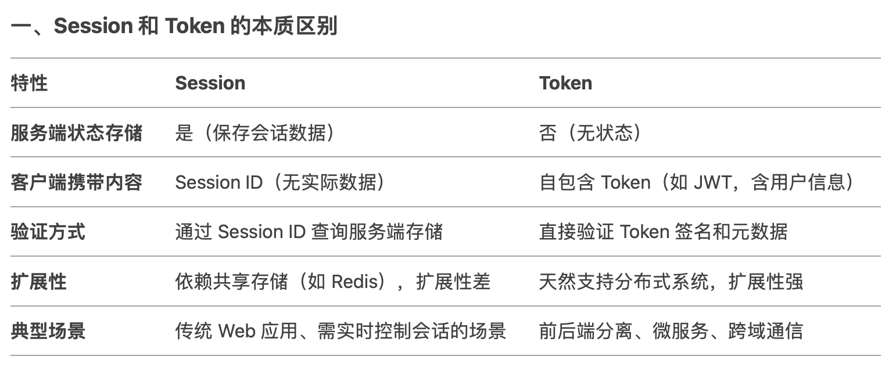

### 一、信息安全三大核心目标
计算机网络安全指通过技术和管理措施，保护网络系统、数据及通信过程免受未经授权的访问、破坏或泄露，确保信息的**机密性**、**完整性**和**可用性**（CIA三要素）。
----------------------------------------------------------------------------------
CIA 要素	防护目标	     典型技术	                                攻击场景举例
----------------------------------------------------------------------------------
机密性	   防止数据泄露	    AES 加密、HTTPS（TLS）、VPN	            中间人窃听、数据库拖库
完整性	   防止数据篡改	    HMAC 签名、SHA-256 哈希	             篡改交易金额、注入恶意代码
可用性	   确保服务持续可用	 DDoS 防护、负载均衡、多活架构	      SYN Flood 攻击、服务器宕机
----------------------------------------------------------------------------------

**名词解释：**
1. DDoS 攻击：通过海量请求耗尽服务器资源（带宽、CPU、内存），导致服务瘫痪。
2. DDoS 防护：识别并过滤恶意流量（如 SYN Flood），仅放行合法请求（流量清洗）。
3. 负载均衡：将请求分发到多台服务器，避免单点过载。
4. 多活架构：多地部署服务器，故障时自动切换。
5. 哈希算法：将数据映射为固定长度的哈希值（如 SHA-256）。若数据被篡改，哈希值会显著变化。
6. HMAC（Hash-based Message Authentication Code）：结合哈希算法和密钥生成消息认证码，确保数据来源可信且未被篡改。
7. AES加密：AES（Advanced Encryption Standard，高级加密标准）是一种广泛使用的对称加密算法。TLS协议主要使用AES加密网页数据。
8. 中间人窃听（Man-in-the-Middle Attack，MITM）：攻击者通过秘密拦截、窃听甚至篡改通信双方的网络信息。
9. 加密技术：对称加密（如 AES-256）加密实际数据；非对称加密（如 RSA）用于安全交换密钥。
10. HTTPS：仅加密浏览器与特定网站之间的通信，不隐藏用户 IP 地址。
11. VPN：加密设备与 VPN 服务器之间的所有流量，隐藏用户真实 IP，显示 VPN 服务器 IP。用户在公共 WiFi 中使用 VPN，即使访问 HTTP 网站，数据仍被加密传输，防止中间人窃听。当然，VPN无法替代 HTTPS 对网站身份的验证。
12. XSS（Cross-Site Scripting）：攻击者通过向网页中注入恶意脚本（通常是 JavaScript），当其他用户浏览该页面时，脚本在其浏览器中执行，从而窃取敏感信息或劫持用户会话。
13. CSRF（Cross-Site Request Forgery） 攻击：攻击者诱使用户在已登录目标网站的状态下，通过第三方网站发起伪造请求，利用浏览器的自动携带 Cookie 机制，以用户身份执行非授权操作。

**VPN详细解释：**
VPN 服务商本质上充当**用户与互联网之间的中间人**，负责转发和加密所有流量。其核心运作流程如下：
1. 用户设备 → VPN 服务器：所有流量加密传输；
2. VPN 服务器 → 目标网站/服务：解密流量并转发请求，接收响应后重新加密回传用户。
虽然 VPN 只加密了用户设备到 VPN 服务器之间的数据（即 第一段链路），而 VPN 服务器到目标服务之间的数据（即 第二段链路）是解密的，但使用 VPN 仍然比直接连接更安全。用户到VPN服务器的流量经过公共WiFi，容易被攻击，而VPN服务器到目标服务的链路通常位于受信任的网络中，攻击者难以介入。

### 二、网络安全分层防御
网络安全防御是一个多层次、多维度的体系，这里只能介绍常见的关键防护措施。下面从 OSI/TCP/IP 模型的维度，分层说明一下不同网络层面临的最常见的威胁和防护措施。先看下面表格：


## 1、Cookie安全配置
一个安全的 Cookie 配置应同时启用 `HttpOnly`、`Secure` 和合理的 `SameSite` 策略：
```http
Set-Cookie: session_id=abc123; Path=/; Secure; HttpOnly; SameSite=Lax
```

**各属性的防御目标总结**
----------------------------------------------------------------------------------
属性	       防御的威胁	            关键作用	                      依赖条件
----------------------------------------------------------------------------------
HttpOnly	XSS 窃取 Cookie	      阻止 JavaScript 访问 Cookie	           无
Secure	    中间人窃听/篡改	         仅通过 HTTPS 传输 Cookie	        全站 HTTPS 配置
SameSite	CSRF 攻击	            限制跨域请求携带 Cookie	             浏览器兼容性
----------------------------------------------------------------------------------
SameSite可选值：
1. SameSite=Strict：Cookie 仅在同站请求（相同域名）中发送。
2. SameSite=Lax（默认）：允许部分跨站请求携带 Cookie（如导航链接 <a href>），**非安全请求（如 POST）不携带**。
3. SameSite=None：允许所有跨站请求携带 Cookie，但必须同时设置 Secure（需 HTTPS）。

# (1) httpOnly
cookie设置了httpOnly，就禁止JavaScript访问，所以，XSS就无法窃取Cookie了。在 Web 开发中，前端也是可以通过 JavaScript 直接调用 `document.cookie` 来设置 Cookie，但是仅针对当前域名下的Cookie，且**无法设置 HttpOnly**，所以不会对安全造成影响。

# (2) Secure
Secure就比较简单了，只要支持https，我们就应该设置成https，而不应用http明文传输。

# （3）SameSite
浏览器在发送 Cookie 时，会严格遵循**域名（Domain）**和**路径（Path）**的匹配规则，同时受**SameSite**属性的控制。那么，跨域跳转是否会携带 Cookie？

当用户从当前页面跳转到第三方页面（不同域名）时，默认情况下不会携带当前页面的 Cookie，但以下两种情况例外：
1. 第三方域名匹配 Cookie 的 Domain 属性
场景：Cookie 的 Domain 被设置为顶级域名（如 Domain=example.com），且用户跳转到子域名（如 https://sub.example.com）。
结果：浏览器会携带该 Cookie，因为 sub.example.com 是 example.com 的子域名。

2. Cookie 的 SameSite 属性为 None
场景：用户通过跨站链接（如 <a href="https://other-site.com">）跳转。
结果：浏览器会携带该 Cookie，但现代浏览器默认禁用 SameSite=None 的非安全 Cookie。

所以，如果有跨站的需求，但是又要避免跨站的CSRF攻击，需要设置SameSite属性为Lax，这也是默认设置，平衡安全与用户体验。

最后要提一点，我们知道浏览器开发者工具是可以看到cookie的。那这种透明的信息有安全风险吗？这属于物理攻击了。攻击者物理接触用户设备，直接通过开发者工具复制 Cookie（如公共场所未锁屏的电脑），也是有可能的。所以，手机电脑不能随意弄丢。

## 2、token鉴权/session鉴权
我们知道，客户端页面请求服务，一般需要登陆态，目的就是为了验证身份。实际上，通常有两种验证身份的方式：Token 和 Session。其中，**Token 是无状态的，session是有状态的**。
1. Session：服务端必须保存会话数据（如用户角色、登录时间），通过 Session ID 关联请求，是典型的有状态设计。
2. Token：服务端不保存任何会话数据，仅验证 Token 的签名和元数据，是无状态设计。

# (1) token
举个适合token的例子，用户进入订单详情页面获取订单数据，服务端直接解析 Token，验证签名和有效期，无需查询外部存储，然后一次性下发所有数据。订单服务使用**无状态服务**即可。无状态的服务，任何多次请求不需要必须访问到同一台服务器；有状态的服务需要保存会话数据，多次请求还必须访问同一台服务器。

# (2) session
再举个适合session的例子，添加购物车。
**步骤1:** 用户登陆后，服务端验证用户名和密码。创建 Session 数据，存储用户信息（如 userId=123、username=Alice）。生成唯一 Session ID（如 session_abc123），并通过 Cookie 返回客户端。
```http
HTTP/1.1 200 OK
Set-Cookie: sessionId=session_abc123; Secure; HttpOnly; SameSite=Strict
```
服务端存储：
```json
// Session 存储（如 Redis）
"session_abc123": {
  "userId": 123,
  "username": "Alice",
  "cartItems": []
}
```

**步骤2:** 添加商品到购物车。用户点击“加入购物车”添加商品，客户端请求：
```http
POST /cart/add HTTP/1.1
Cookie: sessionId=session_abc123
Content-Type: application/json

{ "productId": "A", "quantity": 1 }
```
服务端通过 sessionId=session_abc123 查询 Session 数据。将商品 A 添加到 cartItems 数组，更新 Session 存储：
```json
"session_abc123": {
  "userId": 123,
  "username": "Alice",
  "cartItems": [{ "productId": "A", "quantity": 1 }]
}
```

**步骤3：** 用户再次操作：添加商品 B，流程同上，最终 cartItems 包含商品 A 和 B。

**步骤4：** 查看和结算购物车。用户访问购物车页面。客户端请求：
```http
GET /cart HTTP/1.1
Cookie: sessionId=session_abc123
```
服务端通过 sessionId 查询 Session 数据，获取 cartItems，返回购物车内容（商品 A 和 B）。

如果不使用session，而是无状态token的方案。那每次添加商品，都需要完整发送所有的商品数据给服务端，客户端需要保存所有的商品数据。且服务端无法主动更新客户端状态（如商品下架需等待下次请求同步）。
下图是token和session的对比图：


# (3) 适用场景
1. 适合 Session 的场景
- 传统 Web 应用：需实时控制会话（如强制下线、权限变更）。
- 状态敏感操作：如银行交易需严格跟踪用户上下文。
- 兼容老旧系统：依赖浏览器 Cookie 的自动管理。

2. 适合 Token 的场景
- 前后端分离架构：如 SPA、移动端 App 与 API 通信。
- 跨域/跨服务调用：如单点登录（SSO）、微服务间通信。
- 高并发需求：避免会话存储成为性能瓶颈。


## 3、https
HTTPS（HyperText Transfer Protocol Secure）是HTTP的安全版本，通过TLS/SSL协议实现加密通信。其核心流程分为**握手阶段**（非对称加密交换密钥）和**数据传输阶段**（对称加密传输数据）。

# (1) SSL/TLS 握手过程
**步骤 1**：客户端发起请求（Client Hello）
浏览器向服务器发送请求，包含以下信息：
1. 支持的 SSL/TLS 版本。
2. 支持的加密算法列表（如 RSA、ECDHE）。
3. 一个随机数（Client Random），用于后续生成密钥。

**步骤 2**：服务器响应（Server Hello）
服务器返回响应，包含：
1. 选择的 SSL/TLS 版本和加密算法。
2. 服务器证书（包含公钥和域名等信息）。
3. 一个随机数（Server Random），用于后续生成密钥。

**步骤 3**：验证服务器证书
浏览器检查证书的合法性：
1. 颁发机构（CA）：证书是否由受信任的 CA 签发？
2. 域名匹配：证书中的域名是否与访问的网站一致？
3. 有效期：证书是否在有效期内？
4. 吊销状态：证书是否被吊销（通过 OCSP 或 CRL）？

**步骤 4**：密钥交换（Key Exchange）
1. 非对称加密：浏览器生成一个随机数（Pre-Master Secret，预主密钥），用服务器的公钥加密后发送给服务器。非对称加密公钥可公开，私钥保密。但是，计算速度慢，不适合加密大量数据。所以，只用来传递对称密钥。
2. 对称密钥生成：**双方使用 Client Random、Server Random 和 Pre-Master Secret，通过算法生成相同的「对称密钥」（Session Key）**。

**步骤 5**：完成握手
双方用对称密钥加密通信，后续所有数据传输均使用该密钥加密。

# (2) 握手阶段的攻击/证书
这个过程中，大家可能会有疑问，在握手阶段是否有破绽，让攻击者入侵？首先，如果攻击者截获 Client Random 和 Server Random，但因缺少服务器私钥，无法解密加密的预主密钥，因此无法生成会话密钥。其次，如果截获的是公钥，是没有办法破解任何数据的。

但是，如果截获公钥然后发送奇怪的数据或者修改密钥呢？握手阶段安全性核心在于服务器证书的合法性验证。

1. 证书签发流程：
- 服务器证书由受信任的 证书颁发机构（CA） 签发。
- 对服务器证书的 内容（包括公钥、域名、有效期等）生成一个唯一的哈希值 H1，然后**CA 使用自己的私钥**对 H1 进行**数字签名**。
- 将`原始证书内容`、`数字签名`、`CA 信息`等组合成最终证书文件。

2. 客户端验证流程：
- 浏览器收到证书后，会使用 **CA 的公钥**（预置在操作系统中）解密`数字签名`，得到原始哈希 H1。
- 重新计算证书内容的哈希值 H2，并与原始哈希H1 比对。
- 若内容被篡改（如公钥被修改），哈希值将不匹配，证书验证失败。

这里可能有人有疑问，既然攻击者改了`原始证书内容`既 H2 被改了，那肯定也要用修改后的`原始证书内容`生成新的哈希值，然后重新进行`数字签名`，替换掉现有的签名啊。但是，攻击者做不到这一点，因为数字签名是使用 **CA的私钥**加密的，用户没有CA私钥，没法生成正确的数字签名。

备注：
**加密（Encryption）**：用公钥加密数据，私钥解密数据（保护数据机密性）。
**签名（Signature）**：用私钥加密哈希值，公钥解密哈希值（验证数据完整性）。

# (3) 数据传输阶段的对称密钥
HTTPS的对称密钥安全性依赖于动态生成、临时存储及前向保密技术。
1. 动态生成与临时存储：
生成过程：在TLS握手阶段，客户端和服务器通过非对称加密（如RSA或ECDHE）安全协商出对称密钥（如AES密钥）。该密钥仅用于当前会话。
存储位置：对称密钥仅在客户端和服务器的内存中**临时保存**，不会写入硬盘、数据库或其他持久化存储。会话结束后，密钥立即销毁。

2. 前向保密（Forward Secrecy）：
技术原理：使用ECDHE等算法时，每次会话生成临时的密钥对。即使攻击者获取服务器长期私钥，也无法解密历史会话，因为每次会话的密钥独立生成。
示例：若攻击者截获某次会话的临时私钥，仅能解密该次通信，无法影响其他会话。

所以，对称密钥在每次会话过程中，攻击者窃取密钥的难度如何？首先，对称密钥仅在会话期间有效，攻击者需实时截获内存数据，机会窗口极短。其次，密钥是存在比较安全的内存区域的，直接从内存中获取到密钥难度太大。


