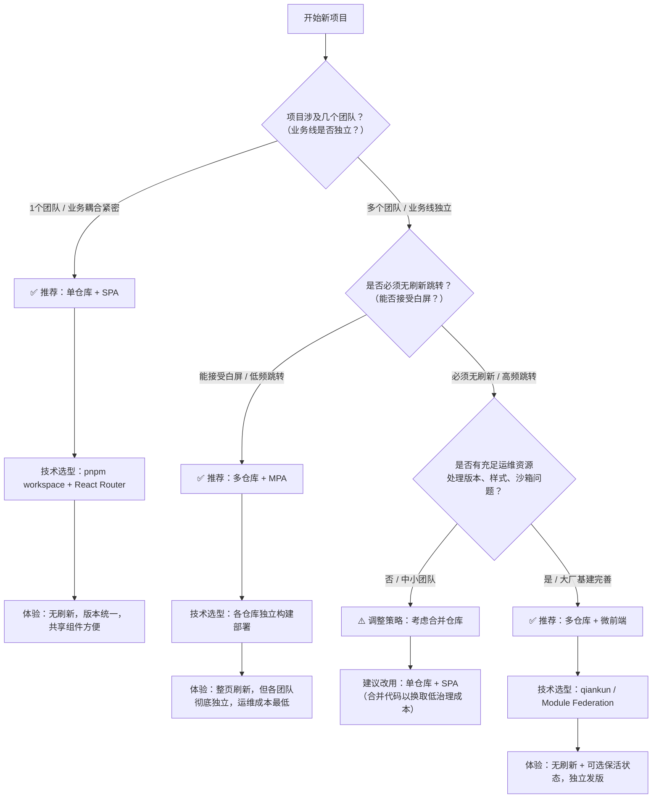

# 前端项目架构与路由选型

> **核心理念前置**：决定“页面怎么跳转”的，从来不是代码怎么放（单仓/多仓），而是代码最终怎么部署（单个HTML还是多个HTML）。

---

## 一、三大核心概念拆解

在开始选型前，请把这三个维度在脑子里彻底分开：

```text
维度         阶段     核心问题                选项一                      选项二
───────────────────────────────────────────────────────────────────────────────────────────────────────
代码组织     开发时   源码放几个 Git 仓库？   单仓库 Monorepo             多仓库 Multi-repo
部署形态     部署时   线上几个 HTML 入口？    SPA 单页（1 个 HTML）       MPA 多页（N 个 HTML）
运行时加载   运行时   JS 怎么聚合执行？       普通加载（同源·同次构建）   微前端（独立构建·运行时集成）
```

---

## 二、关键规则：这三大维度是“正交”的（自由组合）

很多人的困惑在于把这三个维度强行绑定，比如认为“多仓库 = MPA”或“单仓库 = SPA”。**其实它们没有任何必然关系**，只是现实中大家习惯这么搭。

### 1. 代码组织 vs 部署形态（打破绑定）

```text
代码组织            能否部署成 SPA                        能否部署成 MPA
────────────────────────────────────────────────────────────────────────────────────────
多仓库 Multi-repo   ✅ 能（需强行揉成一个，没人这么干）   ✅ 能（最常见，各打各的 HTML）
单仓库 Monorepo     ✅ 能（最常见，统一构建成一个 SPA）   ✅ 能（配多入口，打多个 HTML）
```

> 注：上表说的是**纯构建打包**层面。多仓库想要「单 SPA 体验」其实不必在构建时揉成一个——用 **Module Federation / 微前端在运行时聚合**即可，详见第三节场景 C。

### 2. 部署形态 vs 跳转体验

```text
部署形态      路由跳转机制                     是否刷新                状态是否保留
─────────────────────────────────────────────────────────────────────────────────────────────────────────
MPA 多 HTML   浏览器原生 <a> / location.href   ❌ 整页刷新（白屏）     ❌ 不保留（销毁重建）
SPA 单 HTML   history.pushState + Router       ✅ 无刷新（只换 DOM）   ❌ 默认不留（需 react-activation）
```

---

## 三、现实世界中 4 种标准组合形态

根据你的团队规模、业务耦合度、部署能力，实际项目通常落在下面 4 种情况里：

```text
场景   代码组织   部署形态         典型技术栈                跳转表现                复杂度            适用场景
─────────────────────────────────────────────────────────────────────────────────────────────────────────────────────────────────────────────────
A      多仓库     MPA              各仓库独立 Webpack/Vite   ❌ 整页刷新             ⭐ 极低           中小公司默认；业务独立、低频跳转；成本最低
B      单仓库     SPA              React Router + pnpm       ✅ 无刷新（不留状态）   ⭐⭐⭐ 中等       中后台首选；耦合紧、频繁切页
C      多仓库     SPA 运行时聚合   微前端 qiankun / MF       ✅ 无刷新（可保活）     ⭐⭐⭐⭐⭐ 极高   大型组织；多团队独立发版；治理成本高
D      单仓库     MPA              Webpack 多入口            ❌ 整页刷新             ⭐⭐ 较低         极少用；强隔离 / 兼容老部署
```

---

## 四、核心误区澄清（你之前问过的所有问题，这里一次性闭环）

1. **“多仓库能不能用 React Router 实现无刷新？”**
   - ✅ **能**，前提是把多个仓库强行构建成一个 SPA（场景 A 的变种，但极度痛苦，因为版本冲突）。
   - ❌ **通常不能**，因为多仓库默认各打各的 HTML（MPA），React Router 根本管不到跨 HTML 的跳转。

2. **“单仓库（Monorepo）是不是天然就是 SPA？”**
   - ❌ **不是**。Monorepo 只是代码放在一起，你可以配置成 MPA（打出多个 HTML）或 SPA。但**默认最优解是 SPA**，因为共享代码最方便。

3. **“微前端是不是就是‘1个HTML + 多个JS Bundle’？”**
   - ✅ **在浏览器加载层面，基本是的**（qiankun / Module Federation 这类方案）。**例外**：基于 iframe 的微前端是「多个 document」，并非单个 HTML。
   - ❌ **在工程本质上不是**。普通的 SPA 也是 1 个 HTML + 多个 JS，但那些 JS 是**同一次构建、同一个仓库**产生的。微前端的 JS 是**多次独立构建、多个独立仓库**产生的，因此带来了巨大的**版本协调、样式隔离、沙箱治理**成本。

4. **“微前端到底痛在哪？”**
   - 痛在 **“运行时治理”**：多仓库 MPA 时，A 用 Router v5、B 用 v6 完全不冲突（各跑各的 HTML）。上了微前端塞进同一个页面后，要不要对齐版本，**取决于你怎么集成**：
     - **隔离模式**（iframe / qiankun 沙箱 / Module Federation 不共享单例）：每个子应用各包一层自己的 `<Router>`、各用各的 React 版本，**可以不对齐**，代价是**包体积变大、跨应用通信变复杂**。
     - **共享单例模式**（host 与子应用共用同一个 React / Router 实例，以省体积）：此时**必须对齐版本**，否则 hooks 校验失败，`useNavigate()` 会直接报 “may be used only in the context of a Router”。
   - 此外还有共性的 CSS 互相覆盖、全局变量冲突、跨仓库联调困难。

---

## 五、项目创建决策树（直接抄作业）

当你开始一个新项目时，按下面这个流程做决定，基本不会错：



---

## 六、一句话终极总结

> **多仓/单仓是“源码怎么放”，MPA/SPA是“线上怎么部署”，微前端是“运行时怎么拼”。**
> 
> **优先选“单仓+SPA”**（成本最低，体验最好）；**如果团队实在拆不开，就坦然接受“多仓+MPA”的白屏**；**只有在必须兼顾“多仓独立发版”和“SPA无刷新体验”，且愿意承担极高治理成本时，才上微前端。**