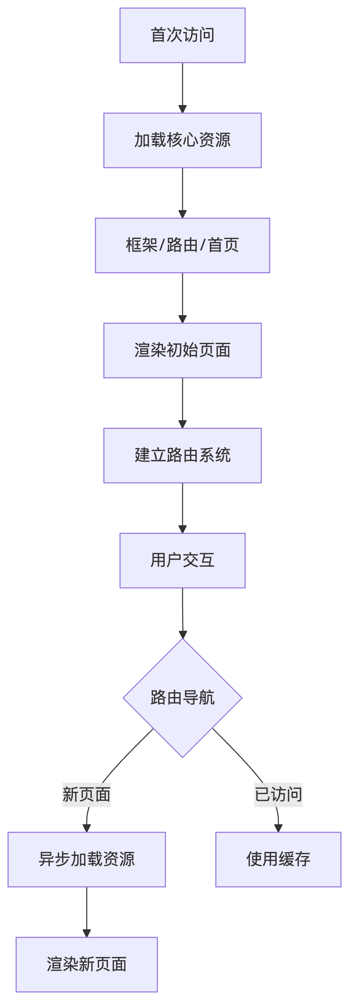
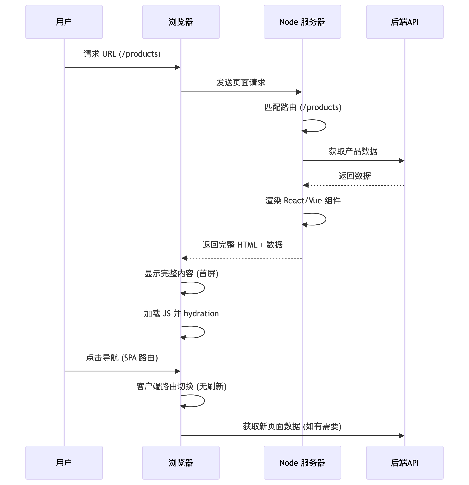

### 一、路由核心概念
## 1. 客户端路由 (SPA路由)
*特点*：单页面应用内部的路由切换

*核心行为*：
 - URL变化但页面不刷新
 - 仅更新部分DOM内容

*实现方式*：
```jsx
// React Router示例
import { BrowserRouter, Routes, Route } from 'react-router-dom';

function App() {
  return (
    <BrowserRouter>
      <Routes>
        <Route path="/" element={<Home />} />
        <Route path="/products/:id" element={<ProductDetail />} />
      </Routes>
    </BrowserRouter>
  );
}
```
1. `BrowserRouter`：这是一个路由器组件，它使用HTML5的history API（pushState, replaceState和popstate事件）来保持UI与URL的同步。通常作为整个应用路由的容器。
2. `Routes`：用于包裹多个`Route`，它会匹配当前URL并只渲染第一个匹配的`Route`对应的组件（在v6中，`Routes`替代了之前的`Switch`）。
3. `Route`：用于定义路由规则，指定当URL匹配某个路径时应该渲染哪个组件。冒号语法 `:id` 表示 URL 变量，实际值可通过 useParams() 钩子获取。useParams() 是 React Router 库提供的一个内置钩子函数，专门用于获取当前 URL 中的动态参数值。
4. React Router v6 使用“精确路径匹配”规则。`/` 只匹配根路径，`/products/:id` 只匹配 `/products/` 后跟非空值的路径。

*核心优势*：
✅ 无刷新页面切换
✅ 应用状态保持
✅ 接近原生应用的体验


## 2. 服务端路由 (MPA路由)
*特点*：传统的多页面应用路由

*核心行为*：
 - URL变化触发完整页面刷新
 - 浏览器向服务器请求新HTML文档

*典型实现*：

```html
<!-- 传统链接跳转 -->
<a href="/contact">联系我们</a>

<!-- JavaScript跳转 -->
<button onclick="location.href='/new-page'">跳转</button>
```

*适用场景*：
 - 传统多页面架构
 - 服务端渲染应用(PHP/JSP)
 - 微前端架构
 - 历史遗留系统


### 二、SPA为何需要路由系统
## 1. 七大核心问题解决方案
```bash
问题类型	           状态管理痛点	           路由解决方案
-----------------------------------------------------------
URL-视图同步	   无法直接访问特定视图	         唯一URL映射
浏览器导航	          前进/后退失效	         History API集成
参数传递	         状态管理复杂化	        路径参数/查询字符串
深层链接	      外部无法直达内部状态	        完整URL支持
组件生命周期	      全量重新渲染	           按需加载组件
权限控制	           逻辑分散	             集中式路由守卫
SEO优化	            难以被爬虫索引	       SSR支持+元数据管理
```

## 2. 关键实现代码
**路由参数解析：**

```jsx
import { useParams, useSearchParams } from 'react-router-dom';

function ProductPage() {
  // 获取路径参数
  const { id } = useParams();
  
  // 获取查询参数
  const [searchParams] = useSearchParams();
  const color = searchParams.get('color');
  
  return <div>产品ID: {id}, 颜色: {color}</div>;
}
```

**路由守卫(权限控制)：**

```jsx
import { Navigate, Route } from 'react-router-dom'; // 官方导入方式

function AuthRoute({ children, roles }) {
  const { user } = useAuth(); // 自定义，模拟鉴权
  const location = useLocation(); // 自定义，模拟定位
  
  if (!user) {
    // 在 AuthRoute 组件内部执行重定向
    return <Navigate to="/login" state={{ from: location }} replace />; // 执行跳转
  }
  
  if (roles && !roles.includes(user.role)) {
    return <Navigate to="/unauthorized" replace />;
  }
  
  return children;
}

// 使用
<Route path="/admin" element={
  <AuthRoute roles={['admin', 'superadmin']}>
    <AdminDashboard />
  </AuthRoute>
} />
```
这里补充一点，React Router 团队将重定向设计为 <Navigate> 组件而非传统的 API 形式（如 history.push()），背后有着深思熟虑的设计哲学和技术考量。
React Router v6 同时提供了两种导航方式：
1. 声明式导航：通过 <Navigate> 组件
2. 命令式导航：通过 useNavigate() 钩子返回的 navigate 函数

一般使用<Navigate>，原因如下：
1. 声明式编程范式
React 的核心哲学是声明式编程，而 <Navigate> 完美契合这一理念：
```jsx
// 声明式：告诉 React "应该是什么状态"
if (unauthorized) {
  return <Navigate to="/login" />;
}
```
对比命令式 API：
```jsx
// 命令式：手动执行操作
useEffect(() => {
  if (unauthorized) {
    navigate('/login');
  }
}, [unauthorized]);
```

2. 渲染周期集成
组件形式能完美融入 React 渲染流程，而 API 调用需要额外处理：
```jsx
// 问题：何时调用 navigate()？
componentDidMount() { /* 可能太早 */ }
useEffect() { /* 可能滞后一帧 */ }
render() { /* 不能在这里调用 */ }
```

3. 位置无关性
<Navigate> 可以在组件树的任何位置使用：

```jsx
function App() {
  return (
    <AuthProvider>
      <ErrorBoundary>
        {/* 这里可以用 Navigate */}
        <MainLayout>
          {/* 这里也可以用 Navigate */}
          <Routes>
            {/* 路由内部还能用 Navigate */}
          </Routes>
        </MainLayout>
      </ErrorBoundary>
    </AuthProvider>
  );
}
```
而传统 API 需要：
 - 依赖上下文 (需要 useNavigate())
 - 只能在函数组件中使用
 - 不能在类组件直接使用

4. 与 Suspense 的完美结合
在 React 18+ 的并发模式下：

```jsx
<Suspense fallback={<Spinner />}>
  {needsRedirect ? (
    <Navigate to="/new-location" />
  ) : (
    <HeavyComponent />
  )}
</Suspense>
```
组件形式：
 - 可以被 Suspense 边界捕获
 - 支持并发渲染特性
 - 避免部分渲染闪烁问题

API 调用无法实现这种无缝集成。

5. 组合性优势
组件形式能轻松组合其他 UI 元素：

```jsx
// 带延迟的重定向
function DelayedRedirect() {
  const [count, setCount] = useState(3);
  
  useEffect(() => {
    const timer = setInterval(() => {
      setCount(c => c - 1);
    }, 1000);
    
    return () => clearInterval(timer);
  }, []);
  
  return count > 0 ? (
    <div>将在 {count} 秒后重定向...</div>
  ) : (
    <Navigate to="/" replace />
  );
}
```
这种组合在 API 方式下需要复杂的状态管理。

7. 设计一致性
React Router v6 的完整导航体系：
```bash
导航类型	 声明式组件	     命令式 API
链接导航	 <Link>	       navigate()
重定向	    <Navigate>	   navigate(..., { replace: true })
表单提交	<Form>	       submit()
```
保持组件/API 的对称设计，降低学习成本。

8. 性能优化
组件形式允许 React Router 在渲染阶段优化,避免不必要的 DOM 更新，与 React 的协调算法协同工作

**何时使用命令式 API？**
虽然 <Navigate> 是首选，但命令式 `navigate()` 仍有其场景：

```javascript
// 更适合事件处理程序
function CheckoutForm() {
  const navigate = useNavigate();
  
  const handleSubmit = async () => {
    await submitOrder();
    navigate('/confirmation'); // 提交后导航
  };
  
  return <form onSubmit={handleSubmit}>...</form>;
}
```


### 三、SPA页面加载策略演进
## 1. 现代SPA加载架构


## 2. 加载优化技术
**代码分割+懒加载：**
```jsx
import { lazy, Suspense } from 'react';

const ProductPage = lazy(() => import('./pages/ProductPage'));

function App() {
  return (
    <Suspense fallback={<PageLoader />}>
      <Routes>
        <Route path="/products" element={<ProductPage />} />
      </Routes>
    </Suspense>
  );
}
```

**智能预加载：**
```jsx
function NavLink({ to, children }) {
  const preload = () => {
    // 根据路径预加载资源
    const path = to.replace(/^\//, '');
    import(`./pages/${path}`).catch(() => {});
  };
  
  return (
    <Link 
      to={to}
      onMouseEnter={preload}
      onFocus={preload}
    >
      {children}
    </Link>
  );
}
```

**数据加载优化：**
```jsx
function ProductDetail() {
  const { id } = useParams();
  const { data, error } = useSWR(`/api/products/${id}`, fetcher, {
    revalidateOnFocus: false,
    dedupingInterval: 60000
  });

  if (error) return <ErrorPage />;
  if (!data) return <LoadingSpinner />;
  
  return <ProductInfo product={data} />;
}
```

### 四、SPA的SSR实现方案
## 1. SSR核心流程


## 2. SPA路由与SSR核心难点与统一解决方案
# 1. 双端路由匹配一致性
*问题本质*：服务端和客户端路由配置不同步导致Hydration失败
*解决方案*：
```javascript
// 共享路由配置 (shared/routes.js)
export const routes = [
  { path: '/', component: Home, fetchData: fetchHomeData },
  { path: '/products/:id', component: ProductDetail, fetchData: fetchProductData }
];

// 服务端使用
import { matchPath } from 'react-router-dom';
import { routes } from './shared/routes';

app.get('*', async (req, res) => {
  const matchedRoute = routes.find(route => 
    matchPath({ path: route.path }, req.path)
  );
  
  if (matchedRoute) {
    const data = await matchedRoute.fetchData(req.params);
    // ...
  }
});

// 客户端使用
import { routes } from './shared/routes';

function App() {
  return (
    <Routes>
      {routes.map((route) => (
        <Route 
          key={route.path} 
          path={route.path} 
          element={<route.component />} 
        />
      ))}
    </Routes>
  );
}
```

# 2. 数据预取的双端协调
*问题本质*：避免数据重复请求和安全传输
*解决方案*：安全的数据注水/脱水机制
```javascript
// 服务端：数据注水
const serializedData = JSON.stringify(data).replace(/</g, '\\u003c');
res.send(`
  <script>
    window.__PRELOADED_STATE__ = ${serializedData};
  </script>
`);

// 客户端：数据脱水
const preloadedData = window.__PRELOADED_STATE__;
delete window.__PRELOADED_STATE__;

// React 18+ 安全数据传递
import { createServerContext } from 'react';

// 服务端
const DataContext = createServerContext();
const html = renderToString(
  <DataContext.Provider value={data}>
    <App />
  </DataContext.Provider>
);

// 客户端
const data = useContext(DataContext);
```

# 3. 路由跳转时的SSR实现
*问题本质*：客户端路由跳转无法触发服务端渲染
*分层解决方案*：
```bash
方案	        实现方式	               适用场景
基础方案	客户端数据预取+加载状态	         中小型应用
进阶方案	部分SSR(Next.js动态导入)	   内容型网站
高级方案	流式SSR(React 18+)	         动态内容页面
终极方案	边缘渲染(Edge SSR)	           全球性应用
```

*边缘渲染实现*：
```javascript
// Next.js边缘函数 (Edge Function)
export const config = { runtime: 'edge' };

export default async function handler(request) {
  // 在CDN边缘节点执行
  const url = new URL(request.url);
  const pathname = url.pathname;
  
  // 边缘路由匹配
  if (pathname.startsWith('/products/')) {
    const productId = pathname.split('/')[2];
    const product = await fetchProduct(productId);
    
    return new Response(renderProductPage(product), {
      headers: { 'Content-Type': 'text/html' }
    });
  }
  
  // 其他路由处理...
}
```

# 4. 动态路由与异步组件
*问题本质*：动态参数解析和代码分割组件的SSR支持
*统一解决方案*：
```javascript
// 动态路由参数解析
app.get('*', (req, res) => {
  const match = matchPath('/products/:id', req.path);
  if (match) {
    const { id } = match.params;
    // 使用id获取数据
  }
});

// 异步组件SSR支持
import { ChunkExtractor } from '@loadable/server';

const extractor = new ChunkExtractor({ statsFile });
const jsx = extractor.collectChunks(<App />);
const html = renderToString(jsx);

res.send(`
  ${extractor.getScriptTags()}
  ${extractor.getLinkTags()}
  ${extractor.getStyleTags()}
`);
```

# 5. 认证状态与重定向
*问题本质*：服务端如何获取客户端状态和安全重定向
*统一解决方案*：
```javascript
// 认证状态同步
app.get('*', (req, res) => {
  const token = req.cookies.authToken;
  const user = token ? verifyToken(token) : null;
  
  // 重定向检查
  if (!user && isProtectedRoute(req.path)) {
    res.redirect(302, `/login?from=${encodeURIComponent(req.url)}`);
    return;
  }
  
  // 渲染逻辑...
});

// 客户端重定向组件
function ProtectedRoute({ children }) {
  const { user } = useAuth();
  const location = useLocation();
  
  if (!user) {
    return <Navigate to="/login" state={{ from: location }} replace />;
  }
  
  return children;
}
```

## 3. SSR路由性能优化方案
# 1. 缓存策略矩阵
```bash
资源类型	 缓存策略	                          实现方式
静态HTML	CDN缓存	                Cache-Control: public, max-age=3600
个性化内容	 边缘缓存	                   Vercel/Netlify边缘函数缓存
API数据	    内存缓存	                     node-cache或redis
组件结构	编译时缓存	                        Next.js静态生成
```

# 2. 流式渲染实现
```javascript
// React 18流式渲染
import { renderToPipeableStream } from 'react-dom/server';

app.get('*', (req, res) => {
  const { pipe } = renderToPipeableStream(
    <App />,
    {
      bootstrapScripts: ['/main.js'],
      onShellReady() {
        res.setHeader('Content-type', 'text/html');
        res.write(`
          <!DOCTYPE html>
          <html>
            <head>...</head>
            <body><div id="root">`);
        pipe(res);
        res.write(`</div></body></html>`);
      },
      onError(error) {
        console.error('渲染错误:', error);
        res.status(500).send('渲染错误');
      }
    }
  );
});
```

# 3. 内存优化策略
```javascript
// 内存监控与限制
const memoryMonitor = setInterval(() => {
  const usedMB = process.memoryUsage().heapUsed / 1024 / 1024;
  if (usedMB > 500) {
    console.warn(`内存使用过高: ${Math.round(usedMB)}MB`);
    // 触发GC或报警
  }
}, 10000);

// PM2配置
module.exports = {
  apps: [{
    name: 'ssr-server',
    script: './server.js',
    max_memory_restart: '1G', // 超过1G自动重启
    env: {
      NODE_ENV: 'production'
    }
  }]
}
```

## 4. 高级场景统一解决方案
# 1. 混合渲染策略
```javascript
// Next.js混合路由
export async function getStaticPaths() {
  return {
    paths: [
      { params: { id: 'popular-1' } },
      { params: { id: 'popular-2' } }
    ],
    fallback: 'blocking' // 其他ID按需SSR
  };
}

export async function getServerSideProps({ params }) {
  // 按需获取数据
  const product = await fetchProduct(params.id);
  
  return { 
    props: { product },
    revalidate: 60 // 60秒后重新验证
  };
}
```

# 2. 国际化路由
```javascript
// 基于URL的国际化
// /en/products, /zh/products

// 服务端检测
app.get('*', (req, res) => {
  const [_, lang] = req.path.split('/');
  const language = supportedLangs.includes(lang) ? lang : 'en';
  
  // 设置语言上下文
  const html = renderToString(
    <I18nProvider lang={language}>
      <App />
    </I18nProvider>
  );
});

// 客户端切换
<Link to={`/${newLang}${currentPathWithoutLang}`}>
  切换语言
</Link>
```

# 3. 灰度发布路由
```javascript
// 基于Cookie的灰度发布
app.get('*', (req, res) => {
  const featureFlag = req.cookies['feature-v2'] === 'enabled';
  
  if (featureFlag) {
    // 渲染新版路由
    return renderV2App(req, res);
  }
  
  // 渲染旧版路由
  renderV1App(req, res);
});
```

## 5. SSR路由难点总结表
```bash
难点类别	  问题表现	            核心解决方案	               关键技术
双端一致性	Hydration报错/UI闪烁	共享路由配置	          React Router配置共享
数据预取	数据重复请求/XSS风险	 安全注水/脱水	           JSON序列化安全处理
路由跳转SSR	跳转时无法触发SSR	     边缘渲染/流式SSR	      Vercel Edge Functions
动态路由	参数解析困难	         统一匹配器	             matchPath, path-to-regexp
异步组件	加载顺序错误	        SSR友好懒加载	         @loadable/component
认证状态	用户状态丢失	        Cookie传递+上下文	     cookie-parser, Context API
重定向	   渲染中断/空白页	        服务端重定向优先	      res.redirect()
性能	   TTFB过高	              流式渲染+缓存	           React 18 Streaming API
内存	   内存泄漏	               内存限制+监控	        PM2, --max-old-space-size
```

## 6. 最佳实践指南
# 1. 路由分层设计
```text
src/
├── routes/
│   ├── core/          # 核心路由配置
│   ├── public/        # 公开路由
│   ├── protected/     # 需认证路由
│   └── utils/         # 路由工具
├── server/
│   ├── renderer.js    # SSR渲染器
│   └── router.js      # 服务端路由处理
└── client/
    └── router.js      # 客户端路由处理
```

# 2. 错误处理三明治模型
```jsx
// 全局错误边界
<ErrorBoundary fallback={<GlobalErrorPage />}>
  {/* 路由级错误边界 */}
  <Routes>
    <Route 
      path="/dashboard" 
      element={
        <ErrorBoundary fallback={<DashboardError />}>
          <Dashboard />
        </ErrorBoundary>
      }
      loader={async () => {
        const data = await fetchData();
        if (!data) throw new Error('Data loading failed');
        return data;
      }}
    />
  </Routes>
</ErrorBoundary>
```