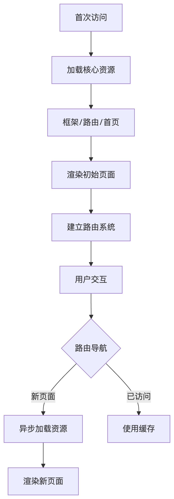
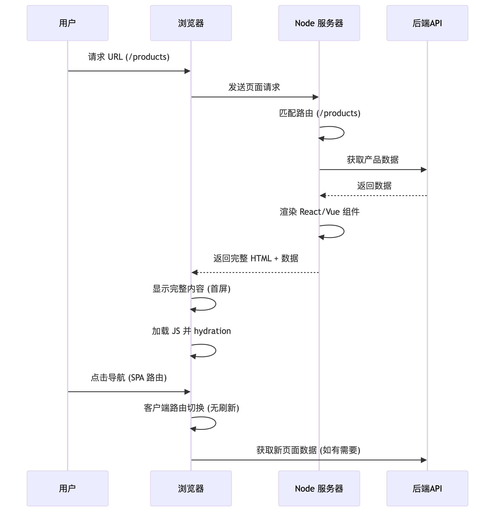

### 一、路由核心概念
## 1. 客户端路由 (SPA路由)
*特点*：单页面应用内部的路由切换

*核心行为*：
 - URL变化但页面不刷新
 - 仅更新部分DOM内容

*实现方式*：
```jsx
// React Router示例
import { BrowserRouter, Routes, Route } from 'react-router-dom';

function App() {
  return (
    <BrowserRouter>
      <Routes>
        <Route path="/" element={<Home />} />
        <Route path="/products/:id" element={<ProductDetail />} />
      </Routes>
    </BrowserRouter>
  );
}
```
1. `BrowserRouter`：这是一个路由器组件，它使用HTML5的history API（pushState, replaceState和popState事件）来保持UI与URL的同步。通常作为整个应用路由的容器。
2. `Routes`：用于包裹多个`Route`，它会匹配当前URL并只渲染第一个匹配的`Route`对应的组件（在v6中，`Routes`替代了之前的`Switch`）。
3. `Route`：用于定义路由规则，指定当URL匹配某个路径时应该渲染哪个组件。冒号语法 `:id` 表示 URL 变量，实际值可通过 useParams() 钩子获取。useParams() 是 React Router 库提供的一个内置钩子函数，专门用于获取当前 URL 中的动态参数值。
4. React Router v6 使用“精确路径匹配”规则。`/` 只匹配根路径，`/products/:id` 只匹配 `/products/` 后跟非空值的路径。

*核心优势*：
✅ 无刷新页面切换
✅ 应用状态保持
✅ 接近原生应用的体验


## 2. 服务端路由 (MPA路由)
*特点*：传统的多页面应用路由

*核心行为*：
 - URL变化触发完整页面刷新
 - 浏览器向服务器请求新HTML文档

*典型实现*：

```html
<!-- 传统链接跳转 -->
<a href="/contact">联系我们</a>

<!-- JavaScript跳转 -->
<button onclick="location.href='/new-page'">跳转</button>
```

*适用场景*：
 - 传统多页面架构
 - 服务端渲染应用(PHP/JSP)
 - 微前端架构
 - 历史遗留系统


## 3. 两个独立维度：CSR/SSR × SPA/MPA
"客户端路由 / 服务端路由"只是表象，真正决定一个项目形态的是**两个互相正交的维度**。

# 1. 维度拆解
```bash
维度一：渲染发生在哪？(Rendering)
   ├── SSR (Server-Side Rendering)：HTML 在服务器拼好
   └── CSR (Client-Side Rendering)：HTML 在浏览器靠 JS 拼

维度二：有几份 HTML 文档？(Document)
   ├── MPA (Multi-Page App)：N 份独立 HTML，跳转走整页刷新
   └── SPA (Single-Page App)：1 份 HTML，跳转靠 history.pushState

⚠️ 这两个维度是【正交】的，4 种组合都存在！
```

# 2. 2×2 架构矩阵
```bash
                 │   MPA（多 HTML，跳转刷新）   │   SPA（1 个 HTML，无刷新切换）
─────────────────┼──────────────────────────┼──────────────────────────
   SSR           │   ① 传统 PHP / JSP        │   ② Next.js / Nuxt
   服务端拼 HTML   │      传统多页应用          │      现代同构应用
─────────────────┼──────────────────────────┼──────────────────────────
   CSR           │   ③ 多页 CSR / 多入口      │   ④ Vite + React Router
   浏览器拼 HTML   │      公司 webapp 架构      │      经典前端脚手架项目
─────────────────┴──────────────────────────┴──────────────────────────
```

# 3. 各组合的真实形态
```bash
组合              实际表现                                典型项目
────────────────────────────────────────────────────────────────────────────
① SSR + MPA      服务器拼完整 HTML,跳转整页刷新           PHP 商城,JSP 后台,WordPress
② SSR + SPA      首屏服务端拼 + hydrate + 后续客户端路由   Next.js,Nuxt,Remix
③ CSR + MPA      多个 .html 空壳,各自 JS 渲染             公司 webapp / 多入口大厂 H5
④ CSR + SPA      一份 index.html,React Router 内部切换    脚手架起的纯前端 SPA
```

# 4. 各组合的优劣速查
```bash
特性              ① SSR+MPA     ② SSR+SPA     ③ CSR+MPA     ④ CSR+SPA
────────────────────────────────────────────────────────────────────────
首屏速度           ✅ 快          ✅ 快          ⚠️ 中         ❌ 慢（要等 JS）
SEO              ✅ 好          ✅ 好          ⚠️ 差         ❌ 差
跳转体验           ❌ 白屏        ✅ 丝滑        ❌ 白屏       ✅ 丝滑
状态保持           ❌ 丢          ✅ 保留        ❌ 丢          ✅ 保留
工程隔离           ✅ 好          ❌ 全打一起     ✅ 业务独立    ❌ 全打一起
服务器压力         ❌ 高          ⚠️ 中         ✅ 低          ✅ 低
开发复杂度         ✅ 简单        ❌ 高（同构）   ⚠️ 中         ⚠️ 中
跨端代码复用       ❌ 无组件       ✅ 有          ✅ 有          ✅ 有
```

### 二、SPA为何需要路由系统
## 1. 七大核心问题解决方案
```bash
问题类型	           状态管理痛点	           路由解决方案
-----------------------------------------------------------
URL-视图同步	   无法直接访问特定视图	         唯一URL映射
浏览器导航	          前进/后退失效	         History API集成
参数传递	         状态管理复杂化	        路径参数/查询字符串
深层链接	      外部无法直达内部状态	        完整URL支持
组件生命周期	      全量重新渲染	           按需加载组件
权限控制	           逻辑分散	             集中式路由守卫
SEO优化	            难以被爬虫索引	       SSR支持+元数据管理
```

## 2. 关键实现代码
**路由参数解析：**

```jsx
import { useParams, useSearchParams } from 'react-router-dom';

function ProductPage() {
  // 获取路径参数
  const { id } = useParams();
  
  // 获取查询参数
  const [searchParams] = useSearchParams();
  const color = searchParams.get('color');
  
  return <div>产品ID: {id}, 颜色: {color}</div>;
}
```

**路由守卫(权限控制)：**

```jsx
import { Navigate, Route } from 'react-router-dom'; // 官方导入方式

function AuthRoute({ children, roles }) {
  const { user } = useAuth(); // 自定义，模拟鉴权
  const location = useLocation(); // 自定义，模拟定位
  
  if (!user) {
    // 在 AuthRoute 组件内部执行重定向
    return <Navigate to="/login" state={{ from: location }} replace />; // 执行跳转
  }
  
  if (roles && !roles.includes(user.role)) {
    return <Navigate to="/unauthorized" replace />;
  }
  
  return children;
}

// 使用
<Route path="/admin" element={
  <AuthRoute roles={['admin', 'superadmin']}>
    <AdminDashboard />
  </AuthRoute>
} />
```
这里补充一点，React Router 团队将重定向设计为 <Navigate> 组件而非传统的 API 形式（如 history.push()），背后有着深思熟虑的设计哲学和技术考量。
React Router v6 同时提供了两种导航方式：
1. 声明式导航：通过 <Navigate> 组件
2. 命令式导航：通过 useNavigate() 钩子返回的 navigate 函数

一般使用<Navigate>，原因如下：
1. 声明式编程范式
React 的核心哲学是声明式编程，而 <Navigate> 完美契合这一理念：
```jsx
// 声明式：告诉 React "应该是什么状态"
if (unauthorized) {
  return <Navigate to="/login" />;
}
```
对比命令式 API：
```jsx
// 命令式：手动执行操作
useEffect(() => {
  if (unauthorized) {
    navigate('/login');
  }
}, [unauthorized]);
```

2. 渲染周期集成
组件形式能完美融入 React 渲染流程，而 API 调用需要额外处理：
```jsx
// 问题：何时调用 navigate()？
componentDidMount() { /* 可能太早 */ }
useEffect() { /* 可能滞后一帧 */ }
render() { /* 不能在这里调用 */ }
```

3. 位置无关性
<Navigate> 可以在组件树的任何位置使用：

```jsx
function App() {
  return (
    <AuthProvider>
      <ErrorBoundary>
        {/* 这里可以用 Navigate */}
        <MainLayout>
          {/* 这里也可以用 Navigate */}
          <Routes>
            {/* 路由内部还能用 Navigate */}
          </Routes>
        </MainLayout>
      </ErrorBoundary>
    </AuthProvider>
  );
}
```
而传统 API 需要：
 - 依赖上下文 (需要 useNavigate())
 - 只能在函数组件中使用
 - 不能在类组件直接使用

4. 与 Suspense 的完美结合
在 React 18+ 的并发模式下：

```jsx
<Suspense fallback={<Spinner />}>
  {needsRedirect ? (
    <Navigate to="/new-location" />
  ) : (
    <HeavyComponent />
  )}
</Suspense>
```
组件形式：
 - 可以被 Suspense 边界捕获
 - 支持并发渲染特性
 - 避免部分渲染闪烁问题

API 调用无法实现这种无缝集成。

5. 组合性优势
组件形式能轻松组合其他 UI 元素：

```jsx
// 带延迟的重定向
function DelayedRedirect() {
  const [count, setCount] = useState(3);
  
  useEffect(() => {
    const timer = setInterval(() => {
      setCount(c => c - 1);
    }, 1000);
    
    return () => clearInterval(timer);
  }, []);
  
  return count > 0 ? (
    <div>将在 {count} 秒后重定向...</div>
  ) : (
    <Navigate to="/" replace />
  );
}
```
这种组合在 API 方式下需要复杂的状态管理。

7. 设计一致性
React Router v6 的完整导航体系：
```bash
导航类型	 声明式组件	     命令式 API
链接导航	 <Link>	       navigate()
重定向	    <Navigate>	   navigate(..., { replace: true })
表单提交	<Form>	       submit()
```
保持组件/API 的对称设计，降低学习成本。

8. 性能优化
组件形式允许 React Router 在渲染阶段优化,避免不必要的 DOM 更新，与 React 的协调算法协同工作

**何时使用命令式 API？**
虽然 <Navigate> 是首选，但命令式 `navigate()` 仍有其场景：

```javascript
// 更适合事件处理程序
function CheckoutForm() {
  const navigate = useNavigate();
  
  const handleSubmit = async () => {
    await submitOrder();
    navigate('/confirmation'); // 提交后导航
  };
  
  return <form onSubmit={handleSubmit}>...</form>;
}
```


### 三、SPA页面加载策略演进
## 1. 现代SPA加载架构


## 2. 加载优化技术
SPA 首屏慢、跳转慢的核心矛盾是"JS bundle 越来越大、数据请求越来越多"。下面三种技术分别从 **代码体积**、**请求时机**、**数据缓存** 三个维度做优化，是任何 SPA 项目都会用到的标配。

# 1. 代码分割 + 懒加载（优化代码体积）
*思路*：路由没访问就不下载对应组件代码，把首屏 bundle 砍小。
```jsx
import { lazy, Suspense } from 'react';

const ProductPage = lazy(() => import('./pages/ProductPage'));

function App() {
  return (
    <Suspense fallback={<PageLoader />}>
      <Routes>
        <Route path="/products" element={<ProductPage />} />
      </Routes>
    </Suspense>
  );
}
```

# 2. 智能预加载（优化请求时机）
*思路*：在用户**真正点击之前**就把代码偷偷加载好（鼠标 hover 时就 import），点击时直接出页面，零等待。
```jsx
function NavLink({ to, children }) {
  const preload = () => {
    const path = to.replace(/^\//, '');
    import(`./pages/${path}`).catch(() => {});
  };
  
  return (
    <Link to={to} onMouseEnter={preload} onFocus={preload}>
      {children}
    </Link>
  );
}
```

# 3. 数据加载优化（优化数据请求）
*思路*：用 SWR / React Query 这类库做请求去重 + 缓存 + 失焦不重验，避免重复请求接口。
```jsx
function ProductDetail() {
  const { id } = useParams();
  const { data, error } = useSWR(`/api/products/${id}`, fetcher, {
    revalidateOnFocus: false,
    dedupingInterval: 60000
  });

  if (error) return <ErrorPage />;
  if (!data) return <LoadingSpinner />;
  
  return <ProductInfo product={data} />;
}
```

# 4. 三种优化技术对比速记
```bash
技术              优化目标         触发时机         适用场景
───────────────────────────────────────────────────────────────────────
代码分割+懒加载   减小首屏 bundle   路由访问时       任何 SPA 都该做
智能预加载        消除点击等待     鼠标 hover 时    导航多、网络一般的应用
数据加载优化      减少接口请求     组件渲染时       中后台、列表-详情页
```


## 3.公司 CRN-Web 的特殊性
> 上面三种技术是**纯 Web SPA 项目**（Vite / Webpack）的标准玩法。但携程的 RN-to-Web 框架 (CRN-Web) 走的是 **RN 共享代码 + 多页 CSR 部署** 的路线，**第 1 项"代码分割+懒加载"用不了**。这一节解释为什么、以及替代方案。

# 1. 根因：Metro 不支持动态 import
React Native 的打包器 **Metro** 设计上就是 **"启动时把所有 JS 一次性塞进 JS 引擎"**，不输出 chunk，也不识别 `import()` 语法。原因有三：
 - 移动端 JS 引擎（Hermes / JSC）不像浏览器有原生 `import()`
 - iOS App Store 审核明确禁止"动态下发可执行代码"
 - RN 想在 Metro / Webpack 之间统一构建产物

CRN（携程 RN 分支）继承了 Metro，所以 **业务代码里写 `import('./xxx')` 编译会报错或被忽略**。

```bash
打包器               支持 import() 拆 chunk？     CRN 用得了吗？
────────────────────────────────────────────────────────────────
Metro (RN/CRN)      ❌ 不支持                    业务侧不能用
Webpack             ✅ 支持                     CRN-Web 底层是 Webpack,但被框架封掉
Vite                ✅ 支持                     不在 CRN 体系内
```

# 2. 第二层约束：多页 CSR 已经是"页面级代码分割"
CRN-Web 的产物部署形态长这样：
```bash
/webapp/cw/hotel/ctOrderDetailPages/
  ├── CancelOrderPage.html       ← 一份独立 bundle
  ├── ChangeOrderPage.html       ← 一份独立 bundle
  └── OrderDetailPage.html       ← 一份独立 bundle
```
**每个业务页本身就是一个 chunk**，CDN 单独缓存、单独发版。再在单页内部用 `React.lazy` 拆 chunk，**收益边际递减**：
 - 首屏 bundle 已经很小（只装当前页代码）
 - chunk 异步下载在弱网下会失败，需要兜底逻辑
 - 一个 .html 一份 bundle 更利于 CDN 命中

所以 CRN-Web 团队选择 **"不在业务侧暴露 `import()`，让所有页面级分割都靠 .html 维度完成"**。

# 3. CRN 的替代方案：lazyRequire（延迟执行而非延迟下载）
RN 社区为这个限制专门发明了 `lazyRequire` 模式，CRN-Web 沿用了它：

```jsx
import { useState, useMemo } from 'react';
import { View, Pressable, Text } from 'react-native';

function OrderDetailPage() {
  const [showInvoice, setShowInvoice] = useState(false);

  const InvoiceModal = useMemo(() => {
    if (!showInvoice) return null;
    return require('./InvoiceModal').default; // 注意:require 不是 import()
  }, [showInvoice]);

  return (
    <View>
      <Pressable onPress={() => setShowInvoice(true)}>
        <Text>查看发票</Text>
      </Pressable>
      {InvoiceModal && <InvoiceModal />}
    </View>
  );
}
```

# 4. lazyRequire vs React.lazy 的本质区别
```bash
对比维度           React.lazy + Suspense              lazyRequire
─────────────────────────────────────────────────────────────────────
是否拆 chunk       ✅ 编译时拆出独立 chunk             ❌ 全部打在一个 bundle
首屏 bundle 大小   ✅ 显著减小                        ❌ 不变
首次访问时机       触发时再发请求下载                  启动时已下载,触发时执行
loading 表现       Suspense 自动接管                  自己 useState + useEffect
优化的是什么       下载流量（网络层）                  执行时间（CPU 层）
适用打包器         Webpack / Vite                     Metro / 任何打包器都行
跨端能否共享代码    ❌ 仅 Web                          ✅ RN + Web 都能跑
```
**一句话**：`React.lazy` 优化"**下载**"，`lazyRequire` 优化"**执行**"。CRN 因为打包器约束只能选后者。

# 5. 真要在 Web 端享受 React.lazy 怎么办
最常见的做法是按平台分文件：
```bash
src/components/HeavyChart/
├── index.tsx               # 共享版本(lazyRequire 风格)
├── index.web.tsx           # ★ Web 专用：用 React.lazy
└── index.native.tsx        # RN 专用：用 require
```
Metro 和 Webpack 都会自动按 `.web.tsx` / `.native.tsx` 后缀挑文件，Web 版本里就能放心用 `React.lazy + Suspense`。但前提是 **CRN-Web 的构建配置允许你用 `import()`**——这点要找基础架构组确认。

# 6. 在 CRN-Web 项目里做加载优化的正确姿势
```bash
优化粒度           推荐方案                          理由
──────────────────────────────────────────────────────────────────────
跨业务线           独立 .html 部署                   天然分割,默认就有
跨页面             独立 .html 部署                   团队隔离 + CDN 友好
页内重组件         lazyRequire + InteractionManager  跨端通用,无 chunk 加载风险
首屏数据           SWR / React Query 缓存            和打包器无关 ✅ 标准玩法可用
图片              懒加载 + WebP                     和打包器无关 ✅ 标准玩法可用
基础库            vendor chunk + CDN 长缓存         CRN-Web 默认已开启
```

**结论**：在携程 CRN-Web 这种 "RN+Web 共享代码 + 多页 CSR" 架构里，**`## 2`** 中的 **第 1 项 "代码分割+懒加载"** 不能直接用，要换成 lazyRequire；**第 2 项 "智能预加载"** 因为用了 `import()` 也不能用；**第 3 项 "数据加载优化"** 跟打包器无关，可以照搬。整体上代码分割是通过 **部署粒度（每页一份 .html）+ lazyRequire（延迟执行）** 两个手段联合达成的。

### 四、SSR 入门必知
## 1. SSR 是什么、解决了什么
*一句话定义*：服务器先用 React 把页面渲染成 HTML 字符串发给浏览器，再让浏览器接管成 SPA。

*为什么需要 SSR*：纯 SPA 有两个硬伤
 - 首屏白屏：要等 JS 下载执行完才能看到内容
 - SEO 差：爬虫抓到的是空 `<div id="root"></div>`

SSR 把这两个问题解决了，同时保留了 SPA 的丝滑切换。

```bash
方案     首屏速度    SEO     交互体验    工程复杂度
─────────────────────────────────────────────────
MPA      ✅ 快      ✅ 好    ❌ 跳转刷新   ✅ 简单
SPA      ❌ 慢      ❌ 差    ✅ 丝滑       ✅ 简单
SSR      ✅ 快      ✅ 好    ✅ 丝滑       ❌ 复杂
```

## 2. SSR 核心流程


简化成 4 步：
```bash
1. 服务器收到请求 → 跑一遍 React → renderToString() 输出 HTML
2. 把数据塞进 <script>window.__DATA__ = {...}</script>（注水）
3. 浏览器拿到完整 HTML 直接显示（首屏可见）
4. 浏览器加载 React bundle → hydrate 接管 → 之后变成 SPA
```

## 3. 三个新手必懂的概念
# 1. Hydration（水合 / 注水）
浏览器拿到服务器渲染的"死 HTML"后，加载一遍 React 代码，把组件树"贴"到这份 HTML 上，让 DOM 重新变成"活的、能响应状态变化的 React 树"。这个过程就叫 Hydration。

```jsx
// 客户端入口（Next.js / 自建 SSR 通用思路）
import { hydrateRoot } from 'react-dom/client';
hydrateRoot(document.getElementById('root'), <App />);
```

⚠️ **新手最常踩的坑**：服务端和客户端渲染结果必须**一模一样**，否则 React 会报 `Hydration mismatch` 警告。常见原因：
 - 用了 `Date.now()` / `Math.random()`（两端时间不一样）
 - 用了 `window` / `localStorage`（服务端没有）
 - 用了 `typeof window !== 'undefined'` 做条件渲染（直接破坏一致性）

# 2. 数据注水 / 脱水（Hydration of Data）
*问题*：服务器查了一遍数据库渲染出 HTML，客户端 hydrate 时如果再请求一次接口就重复了。
*解决*：服务器把数据序列化进 HTML，客户端直接读，避免二次请求。

```javascript
// 服务端：把数据塞进 HTML（注水）
res.send(`
  <div id="root">${html}</div>
  <script>
    window.__INITIAL_DATA__ = ${JSON.stringify(data).replace(/</g, '\\u003c')};
  </script>
`);

// 客户端：从 HTML 取数据（脱水）
const initialData = window.__INITIAL_DATA__;
```

> 注意 `</` 要转义成 `\u003c`，否则攻击者可以在数据里塞 `</script>` 提前闭合脚本标签做 XSS。这是 SSR 的经典安全坑。

# 3. 双端代码共享 (Universal / Isomorphic)
SSR 项目里同一份 React 组件代码要在 **Node 服务器** 和 **浏览器** 两端都能跑，所以不能写浏览器专属 API：

```jsx
// ❌ 服务端会崩
function Page() {
  const w = window.innerWidth; // 服务端没有 window
  return <div>{w}</div>;
}

// ✅ 把客户端独有逻辑放进 useEffect（服务端不会跑）
function Page() {
  const [w, setW] = useState(0);
  useEffect(() => {
    setW(window.innerWidth);
  }, []);
  return <div>{w}</div>;
}
```

## 4. 进阶：为什么 hydrate 不能"自动修复"两端不一致？
新手常会有一个直觉反问：

> "既然 React 能检测到 Hydration mismatch 并报警告，为什么不直接把不一致的部分重新渲染一下？"

这个问题非常好，但它把两件事混淆了。下面拆开讲。

# 1. "检测"和"精确修复"是两件事
React 在 hydrate 时**确实在做检测**，但只是**轻量级的形状校验**：

```bash
React hydrate 实际做的 (轻量级形状校验)
─────────────────────────────────────────────
边遍历 DOM 边对照 React 树:
  "我下一步要渲染 <h1>"
  "DOM 这里是不是 <h1>？"
  ✅ 是 → 复用,绑事件,继续
  ❌ 不是 → 报错/警告,放弃这棵子树

成本: O(n) 单次遍历,几乎零额外开销
能力: 知道"哪里不匹配",但不知道"差在哪个属性 / 哪段文本"
处理: React 18 起会自动降级该子树为 CSR (客户端重渲)
```

```bash
"自动精确修复"需要做的 (重量级差异定位) ← 你直觉里的方案
─────────────────────────────────────────────
解析整份 HTML 成虚拟 DOM,
和 React 输出的虚拟 DOM 全量 diff,
找出每个属性、每段文本的差异。

成本: O(n) + 巨大常数,内存翻倍,
     hydrate 阶段大幅延后,SSR 收益被抵消
能力: 能定位差异,但仍然解决不了下面 3 个本质问题
```

**所以 React 已经做了"检测 + 子树降级"，只是没做"精确逐属性合并"。**

# 2. 即使做了"精确修复",仍有 3 个无法跨越的坑
*坑 1：性能反向劣化*
SSR 的卖点就是 **"快速首屏可交互"**。如果 hydrate 阶段先做全量 DOM diff，**首屏可交互延迟反而被拖长**——直接和 SSR 的初衷冲突。

*坑 2：内容跳变 + 事件丢失*
```jsx
// 服务端 initial=5 → 渲染 "5"
// 客户端 initial=8 → 想渲染 "8"
```
"自动修复"会把已经显示的 "5" 悄悄换成 "8"，用户看到 **内容跳变**。期间用户的点击会绑到错的 DOM 上 → **事件丢失**。这种"看似正常实则错乱"的体验比直接报错更糟。

*坑 3：调试与契约性*
```bash
"严格一致" 模式  → 不一致立刻报警告 → 开发者立刻修
"自动修复" 模式  → 不一致静默兜底 → 线上偶尔闪烁/状态错乱,根因难找
```
React 把"严格一致"作为**契约**，是为了让"违反契约 = 立刻发现"。一旦框架开始"帮你兜底"，bug 就变成幽灵。

# 3. React 的实际方案：把"不一致"做成显式 API
React 没走"自动修复"路线，而是让开发者**主动声明"这里我要不一致"**，框架按声明精确处理：

```bash
API / 方案                         适用场景                       核心思路
────────────────────────────────────────────────────────────────────────────
useEffect                          客户端独有逻辑(读 window 等)    服务端先渲占位,hydrate 后再改
suppressHydrationWarning           已知必然不一致(如时间戳)        告诉 React"别报警,认账"
<Suspense> 选择性 hydrate (R18)    某块加载慢                     按边界异步 hydrate,不阻塞其余
dynamic({ ssr: false }) (Next)     某块组件纯客户端                直接跳过 SSR
'use client' / 'use server' (RSC)  服务端组件 vs 客户端组件        从架构层面区分,服务端组件不 hydrate
Islands 架构 (Astro/Fresh)         默认零 hydrate                只有显式标记的"岛"才 hydrate
```

**演进脉络**：
```
React 16~17：严格一致,不一致就整树重渲(性能差)
React 18：    严格一致,不一致就该子树降级 CSR(默认行为已经是你想要的)
React 18+：   <Suspense> 选择性 hydrate,边界更细粒度
RSC (R19):    'use client' 边界,从架构层面区分服务端/客户端组件
Islands:      默认死 HTML,只 hydrate 标记的岛
```

# 4. 一句话回答最初的疑问
> **不是 "不能允许不一致"，而是 "不能让框架猜不一致是有意还是 bug"。**
> React 选择把判断权交给开发者：你声明清楚是"有意不一致"，框架就精确处理；你没声明就当作 bug 报错。这样既保留了性能、又保留了可调试性，还能演化出 RSC / Islands 这些更精细的架构。

> 你的直觉对到一半：React 18 已经在做"检测 + 子树降级"，但不会做"全量 diff + 精确合并"，因为这条路成本高、体验差、且 RSC/Islands 用更优雅的方式覆盖了这个需求。


## 5. 不要自己造轮子，用框架
SSR 涉及的工程细节非常多（构建、缓存、错误处理、安全注水、流式渲染……），**初学者千万别自己搭**，用成熟框架：

```bash
框架       特点                                         推荐场景
─────────────────────────────────────────────────────────────────
Next.js    React 生态最主流,文件即路由,生态完善           ⭐⭐⭐ 大部分项目首选
Remix      基于 React Router v6.4+ 的 Data API          数据密集型应用
Astro      Islands 架构,默认 SSR + 选择性 hydrate        内容型网站(博客 / 文档)
Nuxt       Vue 版的 Next.js                             Vue 项目
```

Next.js 最简化的 SSR 写法（写一个文件就行，框架包办其余一切）：
```jsx
// pages/products/[id].js
export default function ProductPage({ product }) {
  return <h1>{product.name}</h1>;
}

// 这个函数在服务器跑,数据自动注水到客户端
export async function getServerSideProps({ params }) {
  const product = await fetchProduct(params.id);
  return { props: { product } };
}
```

## 6. SSR 新手最容易踩的 5 个坑
```bash
坑                              原因                              解决
───────────────────────────────────────────────────────────────────────────────
Hydration mismatch              两端渲染输出不一致                  把不一致逻辑放 useEffect
window is not defined           服务端没有浏览器 API                判断 typeof window !== 'undefined'
                                                                  或放到 useEffect 里
数据请求两边都跑了一遍           没做注水/脱水                      用框架的 getServerSideProps / loader
首屏数据闪烁                     hydrate 后又请求一次覆盖           用 SWR/Query 配 fallbackData
跳转后内容没变                   误用了 <a>                        换成 <Link>
```

## 7. 一张图理解 SPA / SSR / SSG
```bash
                         编译时    服务器请求时    浏览器加载时
                         ────────  ──────────────  ─────────────
SPA   (CSR)              空壳HTML        ─          浏览器渲染
SSR   (Server-Side)        ─       服务器现拼HTML   hydrate 接管
SSG   (Static Generation) 预生成HTML      ─         hydrate 接管
ISR   (Incremental SSG)  预生成 + 后台定期/按需重生               (Next.js 特性)
```

入门阶段先掌握 SPA 和 SSR 的区别就够了，SSG / ISR 等到用 Next.js 时再学也不晚。